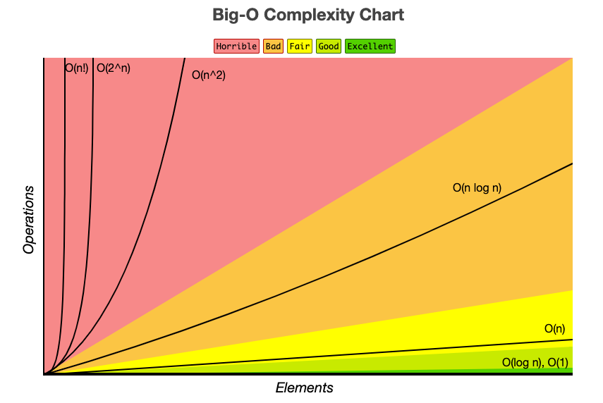
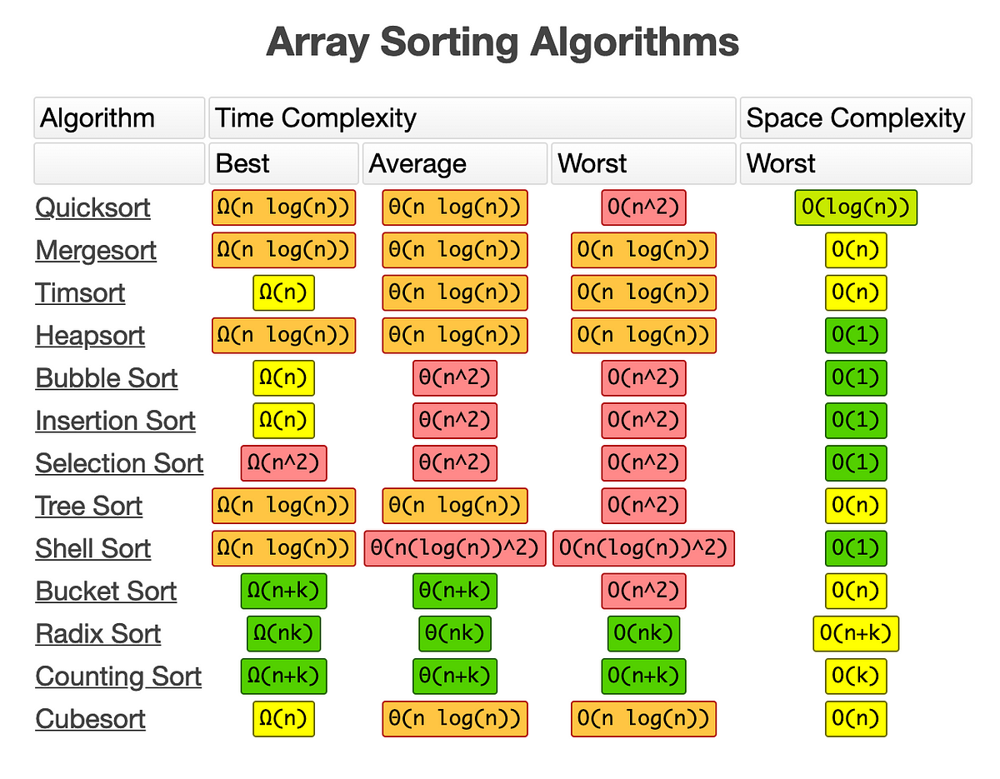

# 시간복잡도 (Time Complexity)

# 1. 시간복잡도란?

알고리즘을 구현할 때 우리는 단순히 동작 여부만이 아니라 성능까지 고려해야 합니다. 그 중 가장 핵심적인 성능 지표가 바로 **시간복잡도(Time Complexity)** 이다.

> 시간 복잡도란, 입력값의 크기(n)에 따라 **알고리즘이 얼마나 많은 연산을 수행하는지**를 나타낸다.
> 

<br>
<br>

# 2. 알고리즘 실행시간을 구성하는 두 가지

알고리즘의 실행 시간은 크게 두 가지 요소로 나눌 수 있다:

1. **실제 실행 환경에 따라 달라지는 시간**
    - CPU 속도, 메모리, 언어, 컴파일러 등 하드웨어/소프트웨어 요인
    - 같은 코드라도 기기에 따라 실행 시간이 다르다.
2. **입력값의 크기에 따른 연산 횟수 증가량** → 우리가 관심 있는 부분
    - 이 증가량을 성장률(Growth Rate)이라고 한다.
    - 이 성장률을 통해 알고리즘이 얼마나 효율적인지 비교할 수 있다.

  
  <p align="center"><small>시간/ 공간 복잡도 속도 비교 차트</small></p>
<br>


# 3. 점근적 표기법(Asymptotic Notation)


실행 시간의 성장률을 수학적으로 표현할 때 사용하는 것이 바로 점근적 표기법이다.

이 표기법은 입력이 무한히 커질 때, 가장 큰 영향을 주는 항만 남겨 알고리즘의 성능을 비교할 수 있게 한다.

### 예시

```
연산 횟수 : 2n² + 5n + 100 → O(n²)
→ 가장 큰 항인 n²만 남기고 상수와 계수는 무시한다.
```

### 점근적 표기법의 종류

| 표기법 | 이름 | 의미 |
| --- | --- | --- |
| **O(f(n))** | Big-O | 최악의 경우 실행 시간 (가장 일반적) |
| Ω(f(n)) | Big-Omega | 최상의 경우 실행 시간 |
| Θ(f(n)) | Big-Theta | 평균의 경우 실행 시간 (이론적으로 정확) |

Big-O를 주로 사용하는데 왜 그럴까?

- `평균(Θ)`은 정확하지만 구하기 어렵고,
- `최선(Ω)`만 고려하면 예외 상황에 대비하기 힘듦
- 반면 `최악(Big-O)`은 항상 보장되는 최대 시간이며,

    → 실전에서 가장 신뢰할 수 있는 기준이다.


<br>

# 4. 시간복잡도 종류와 예시
## O(1) – 상수 시간 (constant time)

> 입력값의 크기에 상관없이 항상 동일한 시간
> 
- 배열 길이에 상관없이 즉시 결과 반환

---

## O(n) – 선형 시간 (linear time)

> 입력값이 커질수록 실행 시간도 비례해서 증가
> 

```
function printAll(arr) {
  for (let i = 0; i < arr.length; i++) {
    console.log(arr[i]);
  }
}
```

- 입력 10배 → 실행 시간도 10배

---

## O(log n) – 로그 시간 (logarithmic time)

> 입력값이 증가해도 실행 시간은 완만하게 증가
> 

```
function binarySearch(arr, target) {
  let left = 0, right = arr.length - 1;
  while (left <= right) {
    const mid = Math.floor((left + right) / 2);
    if (arr[mid] === target) return mid;
    else if (arr[mid] < target) left = mid + 1;
    else right = mid - 1;
  }
}
```

- 이진 탐색, 업&다운 게임처럼 **범위를 절반씩 줄이는 방식**

---

## O(n²) – 이차 시간 (quadratic time)

> 입력값이 커질수록 실행 시간이 제곱 단위로 증가
> 

```c
function printPairs(arr) {
  for (let i = 0; i < arr.length; i++) {
    for (let j = 0; j < arr.length; j++) {
      console.log(arr[i], arr[j]);
    }
  }
}
```

- 입력 100 → 10,000번 연산
- 주로 이중 반복문에서 발생

---

## O(2ⁿ) – 지수 시간 (exponential time)

> 입력 1 증가할 때마다 연산이 2배
> 

```c
function fibonacci(n) {
  if (n <= 1) return 1;
  return fibonacci(n - 1) + fibonacci(n - 2);
}
```

- 재귀 피보나치: n=40만 되어도 수초 소요
- 현실적인 문제에서는 사용 불가 → 꼭 최적화 필요


<br>
<br>


# 5. 입력 크기에 따른 시간 복잡도 예측

---

| 입력 크기 (n) | 사용할 수 있는 복잡도 |
| --- | --- |
| ≤ 500 | O(n³) 이하 가능 |
| ≤ 10,000 | O(n²) 이하 가능 |
| ≤ 1,000,000 | O(n log n) 또는 O(n) 필요 |

예:

- `n = 100만`일 때 `O(n²)` → ❌ 시간 초과
- `n = 500`일 때 `O(n³)` → ✅ 가능

<br>

# 6. 시간 복잡도 분석 요령


| 코드 구조 예시 | 예상 복잡도 |
| --- | --- |
| for문 1개 | O(n) |
| for문 2개 중첩 | O(n²) |
| 이진 탐색 or 반으로 줄이기 | O(log n) |
| for문 + 정렬 (merge sort 등) | O(n log n) |
| 재귀 + 분기 (피보나치, 백트래킹) | O(2ⁿ) |

<br>

<br>

# 7. 정렬별 시간&공간 복잡도 
<br>


<p align="center"><small>정렬 별 시간/공간 복잡도 비교 차트</small></p>
<br>

# 8. 마무리 요약

- **시간 복잡도**는 알고리즘이 얼마나 빠른지를 판단하는 핵심 기준이다.
- 실행 시간은 환경마다 다르지만, **연산 횟수**(성장률)은 명확하다.
- **점근적 표기법**은 복잡도를 단순화해 성능 비교를 쉽게 해준다.
- 대부분의 경우 **최악의 경우(Big-O)** 를 기준으로 알고리즘을 분석한다.
- 입력이 크면 클수록 **복잡도가 낮은 알고리즘을 선택하는 것이 중요**하다.  

