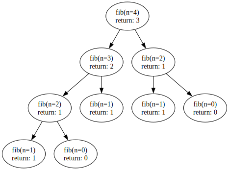
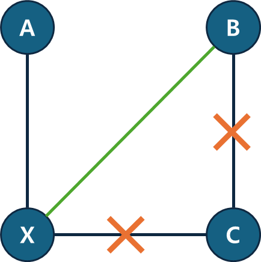

<script type="text/x-mathjax-config">  
        MathJax.Hub.Config({  
        tex2jax: {  
	        inlineMath: [ ['$','$'], ["\\(","\\)"] ],  
	        displayMath: [ ['$$','$$'], ["\\[","\\]"] ],  
	        processEscapes: true  
        },  
        });  
</script>  
<script type="text/javascript" src="https://cdn.mathjax.org/mathjax/latest/MathJax.js?config=TeX-MML-AM_CHTML">  
</script>   
  
<script> MathJax.Hub.Queue(["Typeset",MathJax.Hub]); </script>  

# 동적 프로그래밍 사용 조건

- 겹치는 부분 문제(Overlapping Subproblems): 큰 문제를 작은 문제로 나눌 수 있다.
- 최적 부분 구조(Optimal Substructure): 작은 문제에서 구한 정답은 그것을 포함하는 큰 문제에서도 동이하다.

## 겹치는 부분 문제
부분 문제(subproblem)에 대한 이야기는 이미 책의 앞부분에 등장하고 있다~~(안할수도..?)~~. 재귀에서도, 분할 정복에서도 부분 문제라는 말을 사용하는데, 동적 프로그래밍의 부분 문제와 어떤 차이가 있을까?

동적 프로그래밍에서 다루는 부분 문제는 분할 정복과 비슷하니까, “겹치는” 부분 문제가 있다는 점이 다르다. 큰 문제를 작은 부분 문제로 쪼갤 때, 쪼개진 부분 문제들 사이에 서로 중복이 있어야한다는 뜻이다. 간단히 생각해보면 이해 가능하다. 동적 프로그래밍은 ‘중복’되는 연산을 저장해두고 사용하는 알고리즘이기 때문에 겹치는 문제들이 있어야만 알고리즘을 사용하는 의미가 생긴다. 예를 들어 분할정복의 대표적인 예시인 병합정렬을 살펴보자. 병합 정렬에서는 배열이 겹치지 않는 두 부분으로 분해된다. 이런 경우에는 동적 프로그래밍을 사용할 수 없다. 따로 저장해 둘 부분이 없기 때문이다. (+)반면 분할 정복은 겹치는지 여부가 크게 상관없다. 겹치는 부분 문제에 대해 다루는 로직이 존재하지 않기 때문에, 겹치더라도 겹치는 대로 모두 연산을 진행한다.)

피보나치 수열의 n번째 수를 찾는 코드를 살펴보자. 일반적인 재귀로 작성한 코드는 다음과 같다.
```python
def fib(n) {
	if n == 0: return 0
	if n == 1: return 1
	return fib(n-1) + fib(n-2)
}

fib(4)
```
여기서 `fib(4)`를 실행했을 때 실행되는 재귀 트리를 그리면 다음과 같다



재귀 트리를 살펴보면, `fib(2)`를 계산하는 과정이 여러 번 반복되는 것을 알 수 있다. (`fib(2)`를 루트로 하는 서브트리가 2개 존재한다.) 이렇게 중복된 부분 문제가 등장하는 경우 동적 프로그래밍을 사용하여 연산을 줄일 수 있다. 앞선 `fib(2)`의 결과를 저장해둔다면, 다음 번에 `fib(2)`를 다시 계산 할 필요가 없는 것이다. 따라서 아래와 같은 재귀 트리가 만들어진다.


## 최적 부분 구조
최적 부분 구조는 아래 공식을 만족하는 경우를 말한다.

***큰 문제의 최적해(최선의 답) = 작은 문제들의 최적해의 조합***

하나의 큰 문제에 대한 최선의 답(최적해)에 해당 문제를 이루는 부분 문제들의 최선의 답이 포함되는 경우 그 문제가 최적 부분 구조를 가진다고 말한다.

대표적인 예시로 최단 경로 문제가 있다. 정점 $A$와 $B$의 최단 경로 $p$를 정점 $X$를 기준으로 분해할 수 있다면, 즉, $p = (A, …, X, …, B)$라고 한다면, 부분 경로인 $p' = (A, …, X)$와 $p'' = (X, ….,B)$$도 각각의 정점을 연결하는 최단 경로이다. 쉽게 그림으로 표현하면 다음과 같다.



위 그래프에서 정점 $A$와 $B$의 최단 경로인 $(A,X,B)$를 $X$를 기준으로 나눠보자, 이때 $X$부터 $B$까지의 경로는 실제로 두 가지($(X, B)$, $(X,C,B)$)가 있지만, 둘 중 최단 경로인 $(X,B)$가 포함되어있다. 즉, 더 큰 문제의 최적 해에 부분 경로(부분 문제)의 최적의 해가 포함되어있는 것이다.

최적 부분 구조가 없는 예시: 최장 경로 문제(자세한 설명은 추후 추가)