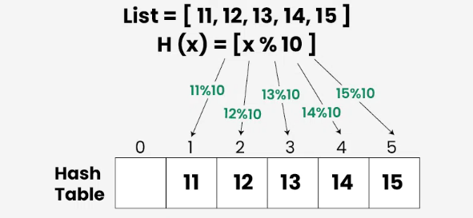
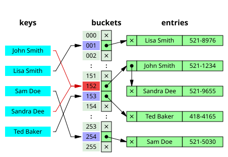
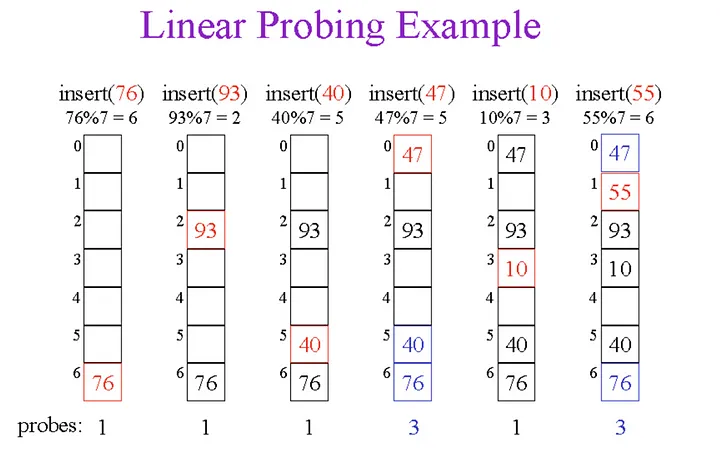
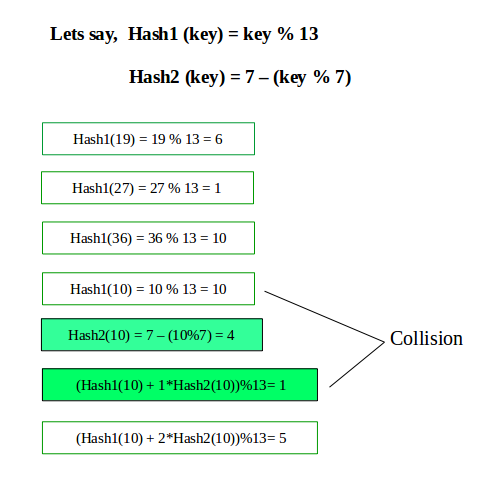

# 해시 테이블(Hash Table)

해시 테이블의 개념을 알아보기 전에, 해시의 개념을 간단하게 알아본다.

# 해시(Hash)란?

해시란, 임의의 크기를 가진 데이터를 고정된 크기의 값으로 변환한 결과를 의미한다. 이때 사용되는 변환 규칙(알고리즘)을 **해시 함수**라고 부른다.

# 해시 테이블의 정의

해시 테이블은, 임의의 키(Key)를 배열의 인덱스로 매핑하기 위해 해시 함수를 사용하는 자료구조이다.



# 해시 테이블의 구조

해시 테이블은 크게 3가지 요소로 구성된다.

### 1. **해시 함수(Hash Function)**:

키를 배열 인덱스로 변환한다.
예시: h("apple") = 42
즉, 문자열 "apple"을 해시 함수로 변환하면 정수 42라는 해시값이 나온다.

### 2. **버킷(Bucket)**:

버킷은 해시 함수에 의해 계산된 인덱스 위치에 실제 데이터를 저장하는 공간이다.

- 해시 테이블은 내부적으로 배열 구조로 되어 있고, 각 배열 요소가 바로 버킷이다.
- 하나의 버킷은 보통 하나의 (Key, Value) 쌍을 저장하지만, 충돌이 발생할 경우 충돌 처리 방식에 따라 구조가 달라진다.

### 3. **충돌 해결(Collision Resolution)**:

서로 다른 키가 같은 인덱스를 가질 경우의 어떻게 처리 할지 결정한다. 해시 테이블이 충돌을 처리하는 방법에는 대표적으로 **체이닝(Chaining)**, **오픈 어드레싱(Open Adressing)** 방법이 있다.

# 해시 테이블은 어디에 사용되고, 왜 필요한가?

해시 테이블은 데이터에 대해 매우 빠른 검색과 접근이 가능하기 때문에, 거의 모든 SW 시스템에서 필수적으로 사용된다.
또한 효율적인 데이터 관리와 해시 함수를 이용해 정보를 암호화하여 저장함으로써 보안측면에서도 장점이 있다.

# 해시 테이블을 사용한 알고리즘

### 1. **중복 검사 or 유일한 값 찾기**

배열이나 문자열에서 중복된 원소가 존재하는지 빠르게 검사할 때 해시 테이블을 활용한다. 해시 테이블에 값을 넣으며 존재 여부를 즉시 확인할 수 있어, O(1) 시간에 탐색이 가능하다.

- 문자열에 같은 문자가 두 번 이상 등장하는가?
- set() 자료형은 내부적으로 해시 테이블을 기반으로 구현되어 있어,
  중복을 제거하거나 유일한 값을 빠르게 판별하는 데 사용된다.

### 2. **빈도 카운팅**

각 요소가 몇 번 등장했는지 세는 작업에 적합하다.

- 가장 많이 등장한 단어 찾기
- 투표 결과 집계

```python
counter = {}
for word in words:
    counter[word] = counter.get(word, 0) + 1
```

### 3. **Two Sum 문제**

배열에서 두 수를 더했을 때 특정 값이 되는 쌍을 찾는 문제는 대표적인 해시 테이블 활용 문제다.

```python
nums = [2, 7, 11, 15], target = 9
```

→ (2, 7)이 정답!

이전 숫자들을 해시 테이블에 저장해두면, 현재 숫자의 보완 값을 O(1) 시간에 찾을 수 있다.


# 해시 테이블의 구현 방식

해시 테이블은 내부적으로 **배열(Array)** 을 기반으로 동작한다.
해시 함수는 입력된 키(Key) 를 정수형 인덱스로 변환하고, 이 인덱스를 이용해 배열의 위치에 데이터를 저장하거나 접근한다.

<!--
그런데, 여기서 **충돌 해결 전략**에 따라 배열 활용 방식이 달라진다.
이번 장에서는 대표적인 두가지 방법에 대해서만 설명한다.

### **1.체이닝(Chaining)**:



체이닝 기법은 같은 인덱스에 여러 데이터를 저장할 수 있도록, 해당 버킷에 연결 리스트를 두는 방법이다.체이닝은 구현이 간단하고 삭제 연산이 유리하다.

**간단 예시**

```python
table = [[] for _ in range(8)]

def h(k): return k % 8

table[h(10)].append(("A", 10))  # 10 % 8 = 2 → table[2]
table[h(18)].append(("B", 18))  # 18 % 8 = 2 → table[2] 충돌 → 리스트에 추가
```

**결과구조**

```python
table = [
    [],        # index 0
    [],        # index 1
    [("A", 10), ("B", 18)],  # index 2 → 충돌난 값들이 리스트로 연결됨
    [], [], [], [], []
]
```

### **2.오픈 어드레싱(Open Addressing)**:


충돌이 발생하면, 다른 빈 버킷을 찾아 이동하여 저장한다. 모든 데이터는 '해시 테이블 내부'에 저장되는 점이 체이닝과 다른 점이다.
오픈 어드레싱 방법은, 저장 공간이 한정되어 있기 때문에 해시 테이블에 데이터가 많이 차 있는 경우 성능이 급격히 저하될 수 있다.

충돌 해결을 위한 방식으로는 다음과 같은 기법들이 있다:

### **2-1.선형 탐사**:



선형탐사는 가장 기본적인 충돌해결기법으로, 위에서 설명한 기본적인 동작방식이다. 바로 다음 칸부터 차례대로 탐색한다.

예시:

```python
table = [None] * 8
def h(k): return k % 8

# 10 → 2번 칸
# 18 → 2번 충돌 → 3번 빈칸 사용
table[h(10)] = "A"     # table[2] = "A"
table[(h(18)+1) % 8] = "B"   # table[3] = "B"
```

### **2-2.제곱 탐사**:


곱탐사는 말 그대로 제곱 간격으로 간격을 점점 넓혀가며 탐색한다. 선형탐사에 비해 더 폭넓게 탐사하기 때문에 탐색과 삭제에 효율적일 수 있다.

### **2-3.더블 해싱**:



해시 충돌이 발생했을 때, 두 번째 해시 함수를 이용해 탐색 간격을 계산하고 그 간격만큼 떨어진 버킷에 저장한다.

예시:

```python
버킷 수 = 13 # Mod 13

R = 7 # 보조 해시용 소수

#해시 함수 정의:
Hash1(key) = key % 13

Hash2(key) = 7 - (key % 7)

Hash1(36) = 36 % 13 = 10   #10번인덱스에 저장 (충돌 X)

Hash1(10) = 10 % 13 = 10 # 충돌 발생!

Hash2(10) = 7 - (10 % 7) = 4  # 더블해싱으로 충돌 해결 

```
-->

# 해시 테이블의 시간복잡도, 공간복잡도

### 시간복잡도


| 연산 종류     | 평균 시간복잡도 | 최악의 시간복잡도 |
| --------------- | ----------------- | ------------------- |
| 검색 (Search) | O(1)            | O(n)              |
| 삽입 (Insert) | O(1)            | O(n)              |
| 삭제 (Delete) | O(1)            | O(n)              |

- 충돌이 너무 많이 발생할 시 최악의 경우 선형 시간까지 걸릴 수 있다.

### 공간복잡도


| 구성 요소                 | 공간복잡도 |
| --------------------------- | ------------ |
| 해시 테이블 자체          | O(n)       |
| 체이닝 (연결 리스트 포함) | O(n + k)   |
| 오픈 어드레싱             | O(n)       |

- n: 버킷 개수
- k: 저장된 실제 데이터 개수

### 질문/문제?

### References

- https://www.geeksforgeeks.org/hash-table-data-structure/
- https://en.wikipedia.org/wiki/Hash_table
