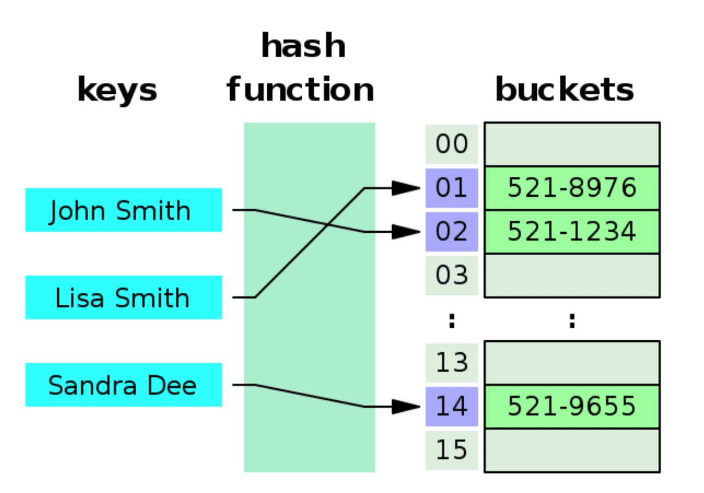

## 📑 목차

- [해시 테이블(Hash Table)](#해시-테이블hash-table)
- [해시(Hash)란?](#해시hash란)
- [해시 테이블의 정의](#해시-테이블의-정의)
- [해시 테이블의 구조](#해시-테이블의-구조)
  - [1. **해시 함수(Hash Function)**:](#1-해시-함수hash-function)
  - [2. **버킷(Bucket)**:](#2-버킷bucket)
  - [3. **충돌 해결(Collision Resolution)**:](#3-충돌-해결collision-resolution)
- [해시 테이블은 어디에 사용되고, 왜 필요한가?](#해시-테이블은-어디에-사용되고-왜-필요한가)
- [해시 테이블을 사용한 알고리즘](#해시-테이블을-사용한-알고리즘)
  - [1. **중복 검사 or 유일한 값 찾기**](#1-중복-검사-or-유일한-값-찾기)
  - [2. **빈도 카운팅**](#2-빈도-카운팅)
  - [3. **Two Sum 문제**](#3-two-sum-문제)
- [해시 테이블의 구현 방식](#해시-테이블의-구현-방식)
- [Python에서의 해시 테이블](#python에서의-해시-테이블)
  - [딕셔너리는 해시 테이블이다](#딕셔너리는-해시-테이블이다)
- [해시 테이블의 시간복잡도, 공간복잡도](#해시-테이블의-시간복잡도-공간복잡도)
  - [시간복잡도](#시간복잡도)
  - [공간복잡도](#공간복잡도)
- [퀴즈](#퀴즈) - [1. 문자열에서 가장 먼저 중복되지 않는 문자를 반환하는 프로그램을 작성하시오.](#1-문자열에서-가장-먼저-중복되지-않는-문자를-반환하는-프로그램을-작성하시오)
- [References](#references)

# 해시 테이블(Hash Table)

해시 테이블의 개념을 알아보기 전에, 해시의 개념을 간단하게 알아본다.

# 해시(Hash)란?

해시란, 임의의 크기를 가진 데이터를 고정된 크기의 값으로 변환한 결과를 의미한다. 이때 사용되는 변환 규칙(알고리즘)을 **해시 함수**라고 부른다.

# 해시 테이블의 정의

해시 테이블은, 임의의 키(Key)를 배열의 인덱스로 매핑하기 위해 해시 함수를 사용하는 자료구조다.



# 해시 테이블의 구조

해시 테이블은 크게 3가지 요소로 구성된다.

## 1. **해시 함수(Hash Function)**:

키를 해시값으로 변환한다.

```python
print(hash("apple"))
# 출력: 8176427328531839027
```

즉, 문자열 "apple"을 해시 함수로 변환하면 817642... 라는 정수 해시값이 나온다.

## 2. **버킷(Bucket)**:

버킷은 해시 함수에 의해 계산된 인덱스 위치에 실제 데이터를 저장하는 "공간"이다.

- 해시 테이블은 내부적으로 배열 구조로 되어 있고, 각 배열 요소가 바로 버킷이다.
- 하나의 버킷은 보통 하나의 (Key, Value) 쌍을 저장하지만, 충돌이 발생할 경우 충돌 처리 방식에 따라 구조가 달라진다.

```python
size = 8  # 해시 테이블의 버킷(배열) 개수

key = "apple"
index = hash("apple") % size  # 예: 8176427328531839027 % 8 = 3

# → 즉, "apple"은 3번 버킷에 저장됨
```

```python
table = [
    [],     # index 0
    [],     # index 1
    [],     # index 2
    [("apple", 10)],  # index 3 → 버킷
    [],     # index 4
    [],     # index 5
    [],     # index 6
    []      # index 7
]
```

## 3. **충돌 해결(Collision Resolution)**:

서로 다른 키가 같은 인덱스를 가질 경우의 어떻게 처리 할지 결정한다. 해시 테이블이 충돌을 처리하는 방법에는 대표적으로 **체이닝(Chaining)**, **오픈 어드레싱(Open Adressing)** 방법이 있다.

# 해시 테이블은 어디에 사용되고, 왜 필요한가?

해시 테이블은 데이터에 대해 매우 빠른 검색과 접근이 가능하기 때문에, 거의 모든 SW 시스템에서 필수적으로 사용된다.
또한 효율적인 데이터 관리와 해시 함수를 이용해 정보를 암호화하여 저장함으로써 보안측면에서도 장점이 있다.

# 해시 테이블을 사용한 알고리즘

## 1. **중복 검사 or 유일한 값 찾기**

배열이나 문자열에서 중복된 원소가 존재하는지 빠르게 검사할 때 해시 테이블을 활용한다. 해시 테이블에 값을 넣으며 존재 여부를 즉시 확인할 수 있어, O(1) 시간에 탐색이 가능하다.

- 문자열에 같은 문자가 두 번 이상 등장하는가?
- set() 자료형은 내부적으로 해시 테이블을 기반으로 구현되어 있어,
  중복을 제거하거나 유일한 값을 빠르게 판별하는 데 사용된다.

## 2. **빈도 카운팅**

각 요소가 몇 번 등장했는지 세는 작업에 적합하다.

- 가장 많이 등장한 단어 찾기
- 투표 결과 집계

## 3. **Two Sum 문제**

배열에서 두 수를 더했을 때 특정 값이 되는 쌍을 찾는 문제는 대표적인 해시 테이블 활용 문제다.

```python
nums = [2, 7, 11, 15], target =9

# 정답 : (2, 7)
```

# 해시 테이블의 구현 방식

해시 테이블은 내부적으로 **배열(Array)** 을 기반으로 동작한다.
해시 함수는 입력된 키(Key) 를 정수형 인덱스로 변환하고, 이 인덱스를 이용해 배열의 위치에 데이터를 저장하거나 접근한다.

# Python에서의 해시 테이블

## 딕셔너리는 해시 테이블이다

파이썬의 내장된 자료형인 dict(딕셔너리)는 내부적으로 해시 테이블을 기반으로 구현되어 있다.

```python
student = {
    "name": "Justin",
    "age": 20,
    "major": "Computer Science"
}
```

위의 코드를 예로 들면, 파이썬 딕셔너리에서 내부적으로 이렇게 저장된다.

```python
hash("name") % N → 인덱스 3번 버킷 → ("name", "Alice")
hash("age")  % N → 인덱스 1번 버킷 → ("age", 20)
hash("major")% N → 인덱스 5번 버킷 → ("major", "Computer Science")

```

# 해시 테이블의 시간복잡도, 공간복잡도

### 시간복잡도

| 연산 종류     | 평균 시간복잡도 | 최악의 시간복잡도 |
| ------------- | --------------- | ----------------- |
| 검색 (Search) | O(1)            | O(n)              |
| 삽입 (Insert) | O(1)            | O(n)              |
| 삭제 (Delete) | O(1)            | O(n)              |

- 충돌이 너무 많이 발생할 시 최악의 경우 선형 시간까지 걸릴 수 있다.

### 공간복잡도

| 구성 요소                 | 공간복잡도 |
| ------------------------- | ---------- |
| 해시 테이블 자체          | O(n)       |
| 체이닝 (연결 리스트 포함) | O(n + k)   |
| 오픈 어드레싱             | O(n)       |

- n: 버킷 개수
- k: 저장된 실제 데이터 개수

# 퀴즈

#### 1. 문자열에서 가장 먼저 중복되지 않는 문자를 반환하는 프로그램을 작성하시오.

```
입력: "AABBCDDE"
출력: "C"
```

정답 코드:

```python
def first_non_repeating_char(string):
    freq = {}  #반복수를 담을 딕셔너리
    for char in string:

       # 각 문자의 등장 횟수 계산
        if char not in freq:
            freq[char]=1
        else:
            freq[char]+=1


    for char in string:
        if freq[char] == 1:  # 등장 횟수가 1인 첫 문자를 반환
            return char

    return None  # 중복되지 않은 문자가 없을 경우

```

# References

- [geeks for geeks](https://www.geeksforgeeks.org/hash-table-data-structure/)
- [wikipedia](https://en.wikipedia.org/wiki/Hash_table)
