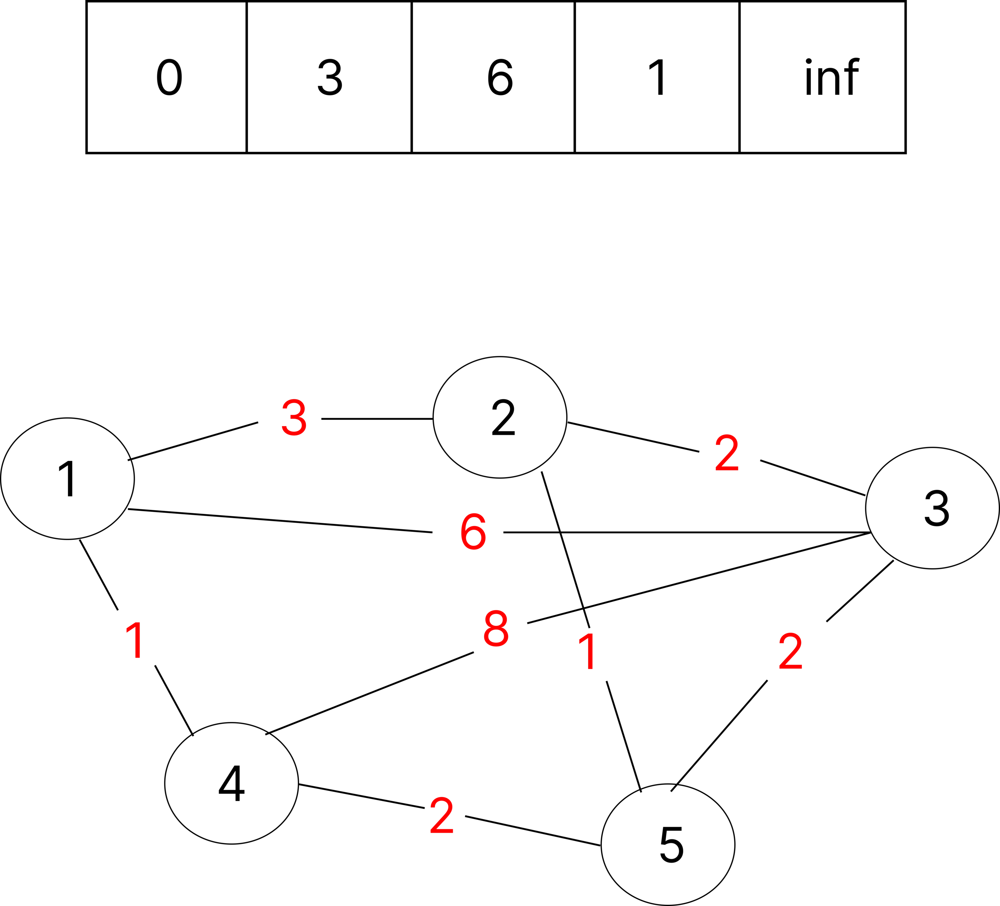
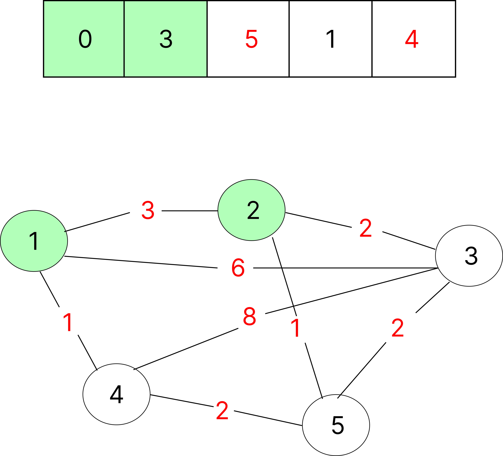
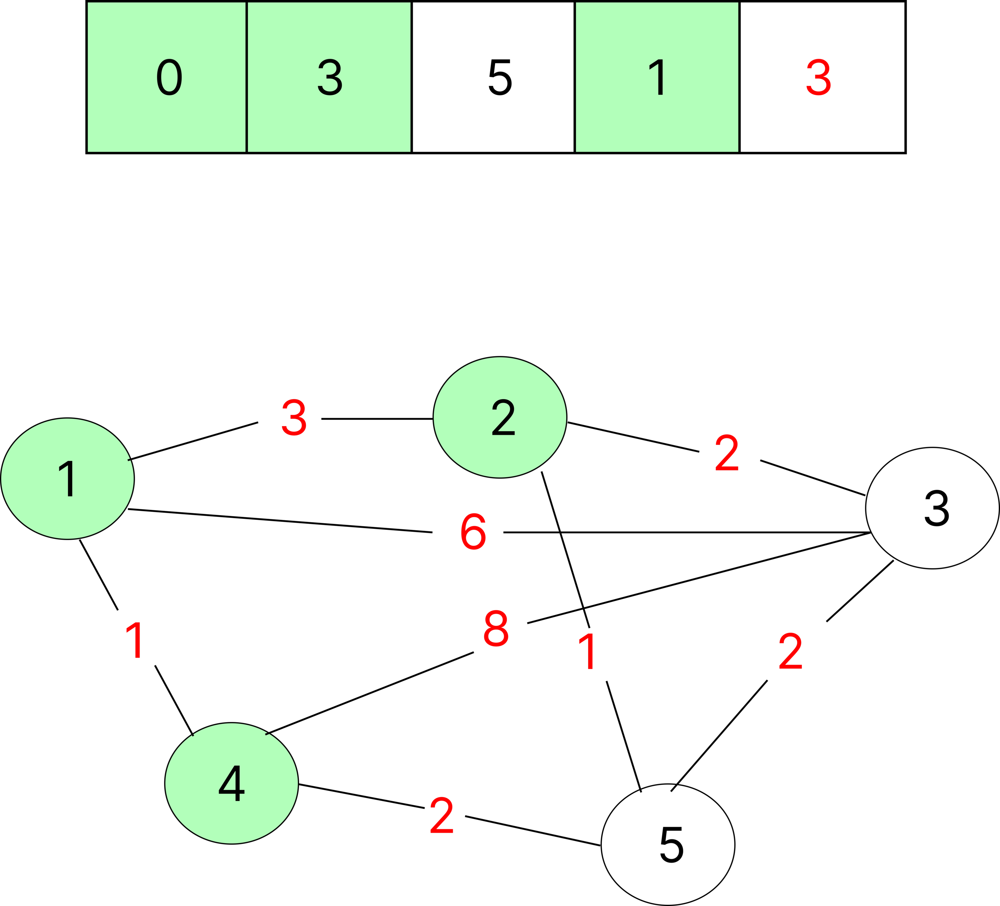

# 다익스트라(Dijkstra) 알고리즘

단일 시작점(정점)에서 모든 정점까지의 최단 경로를 구하는 알고리즘인 다익스트라 알고리즘(Dijkstra’s Algorithm)의 핵심 개념과 동작 방식을 이해한다.

> 다익스트라 알고리즘은 가중치가 있는 그래프에서 **최단 경로 문제를 해결하는 대표적인 방법이다.**
<br>

# 핵심 키워드 정리
- 정의: [예시] DP 혹은 그리디 알고리즘으로 불리는 다익스트라는 사용한 최단 경로(비용)를 찾는 알고리즘이다.

- 자료구조: 선형 탐색, 우선순위 큐

- 시간복잡도: O(V²), O((V + E) log V)

- 공간복잡도: 
    - 우선순위 큐: O(V + E)
        - adj (인접 리스트): 	O(V + E)
        - dist (거리 배열): O(V)
        - pq (우선순위 큐): O(V) ~ O(E)
    - 선형 탐색 : O(V²)
        - g (인접 행렬): O(V²)
        - distances (거리 배열): O(V)
        - visited (방문 여부 배열): O(V)
<br>

# 다익스트라란
- DP 혹은 그리디 알고리즘으로 불리는 다익스트라 알고리즘은 하나의 정점로부터 최단 경로(가장 비용이 적은 경로)를 찾는 알고리즘이다.

- 하나의 특정 정점에서 다른 모든 정점로 가는 최단 경로를 알려준다.

- 그래프의 방향이 상관없는 무향 그래프이다.

- 음의 간선이 존재하지 않는다.
    - 음의 간선은 음의 가중치(-)를 가진 간선을 말한다.

- 어떤 문제 유형에 자주 등장하는가?

    - 예: 최단 경로(도시에서 모든 도시까지의 최소 비용)

# 알고리즘 실행 과정
빨간색 글씨로 표시되는 값이 정점 방문 시 변경되는 최소값이다.
<br><br>


<!-- ### 정점 방문 전 기본 값

<br><br><br>

### 1번 정점 -> 1번 정점(본인) 방문

<br><br><br>

### 1번 정점 -> 2번 정점 방문

<br><br><br>

### 1번 정점 -> 4번 정점 방문

<br><br><br>

### 1번 정점 -> 3번 정점 방문

<br><br><br>

### 1번 정점 -> 5번 정점 방문
 -->
<br>

> 초기값
- [0, 3, 6, 1, inf]
<br>
<br>
> 1번 정점 기준 모든 정점을 방문한 후
- [0, 3, 5, 1, 3]
<br><br>

# 구현 예시 (Python)

### 다익스트라 - 선형 탐색
``` python
iterator = 5
inf = float('inf')

g = [
    [0, 3, 6, 1, inf],
    [3, 0, 2, inf, 1],
    [6, 2, 0, 8, 2],
    [1, inf, 8, 0, 2],
    [inf, 1, 2, 2, 0]
]

visited = [False] * iterator
distances = [0] * iterator 

# 가장 최소 거리를 가지는 정점를 반환
def getSmallIndex():
    min_distance = float('inf')
    index = 0

    for i in range(iterator):
        if distances[i] < min_distance and not visited[i]:
            min_distance = distances[i]
            index = i

    return index

def dijkstra(start):
    # distances 초기화
    for i in range(iterator):
        distances[i] = g[start][i]

    # start 인덱스 방문 완료
    visited[start] = True
    
    for _ in range(0, iterator-2):
        currentIndex = getSmallIndex()
        visited[currentIndex] = True
        for j in range(iterator):
            if not visited[j]:
            # 현재 정점에서 방문하지 않은 모든 정점를 순회하면서 
            # 이전에 저장되어 있는 거리와 현재 계산한 거리를 비교하여 새로운 값을 넣어준다.
                if distances[currentIndex] + g[currentIndex][j] < distances[j]:
                    distances[j] = distances[currentIndex] + g[currentIndex][j]

# 그래프 0행 확인
dijkstra(0)
# n번 열까지 반복하면서 출력
for i in range(iterator):
    print(f"{distances[i]}", end=" ")
```

### 다익스트라 - 우선순위 큐
``` python
import heapq
import sys

# 인접 행렬 생성
def constructAdj(edges, V):
    
    # adj[u] = list of [v, wt]
    adj = [[] for _ in range(V)]

    for edge in edges:
        u, v, wt = edge
        adj[u].append([v, wt])
        adj[v].append([u, wt])

    return adj


def dijkstra(V, edges, src):
    # 인접 행렬 함수 호출
    adj = constructAdj(edges, V)

    # 우선순위 큐 for 정점를 담을 배열
    pq = []
    
    # 최소 거리를 측정하기 위해 최대 거리로 V 수만큼 설정
    dist = [sys.maxsize] * V

    heapq.heappush(pq, [0, src])
    dist[src] = 0


    while pq:
        # 시작 정점를 가져오기
        u = heapq.heappop(pq)[1]

        # 인접한 모든 정점들을 순회
        for x in adj[u]:
            # 정점와 가중치를 가져온다.
            v, weight = x[0], x[1]
						
            # 현재까지 발견한 최단 거리와 현재 거리를 비교
            if dist[v] > dist[u] + weight:
                dist[v] = dist[u] + weight
                heapq.heappush(pq, [dist[v], v])

    return dist

V = 5
src = 0

# 엣지 목록 : {u, v, weight}
edges = [[0, 1, 3], [0, 2, 6], [0, 3, 1], [1, 2, 2], [1, 4, 1], [2, 3, 8], [2, 4, 2], [3, 4, 2]]

result = dijkstra(V, edges, src)

print(' '.join(map(str, result)))
```
파이썬을 사용하여 알고리즘을 구현한 코드

# 참고
- 참고한 자료

    - [GeeksforGeeks의 Dijkstra's Algorithm](https://www.geeksforgeeks.org/dijkstras-shortest-path-algorithm-greedy-algo-7/)

    - [나무위키 - 다익스트라](https://namu.wiki/w/%EB%8B%A4%EC%9D%B5%EC%8A%A4%ED%8A%B8%EB%9D%BC%20%EC%95%8C%EA%B3%A0%EB%A6%AC%EC%A6%98)

- 추가로 참고하면 좋은 자료

    - Visualgo - Graph Algorithms

    - 위키백과 - 다익스트라

    - CP-Algorithms - Dijkstra