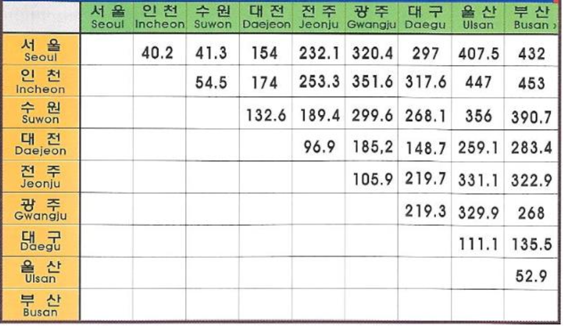

# 플로이드 와샬 알고리즘

## 모든 쌍 최단 경로 문제

정점들의 집합 $V$와 가중치 $w(e)$ 가 존재하는 간선들의 집합 $E$ 를 갖는 그래프 $G = (V,E,w)$ 에 대하여
각 정점에 대한 모든 쌍 사이의 최단 경로를 찾는 것을 목표로 한다.
>플로이드 와샬은 모든 쌍 최단 경로 문제를 해결하는 대표 알고리즘이다.
    
<p align= "center">
    
</p>
    
## 플로이드 와샬의 개념

> 작은 그래프에서 부분 문제를 찾는 것이 핵심이다.

<p align= "center">
    
</p>

그림 <2.1>은 3개의 정점과 3개의 간선으로 이루어진 작은 예시 그래프이다.
- 위의 그래프에서 A ⇒ C 최단 경로를 찾으려면 2가지 경로가 존재한다.
    - A ⇒ C : 직접 가는 경로
    - A ⇒ "B" ⇒ C :  정점 B를 경유하는 경로
- 두 경로 중에서 짧은 것을 선택한다.
- 모든 점을 경유 가능한 점들로 고려하면, 모든 점에 대한 각 쌍의 최단 경로를 찾을 수 있다.

<p align= "center">
    
</p>


그림 <2.2>는 $V$개의 정점을 가진 그래프에서 모든 쌍 최단 거리 문제를 해결하는 과정을 도식화 한 것이다.
정점 $i$ 부터 정점 $j$ 까지 정점 $k$ 를 방문하는 경로를 고려하고 있다.


## 코드 구현

   
> 플로이드 와샬 알고리즘의 장점은 구현이 간단하고 쉽다는 점이다.

```python
# 플로이드 와샬 알고리즘 수행
for k in range(n):         # 거쳐가는 노드
    for i in range(n):     # 출발 노드
        for j in range(n): # 도착 노드
            if graph[i][k] + graph[k][j] < graph[i][j]:
                graph[i][j] = graph[i][k] + graph[k][j]
```

## 수행 과정

<p align= "center">
    
</p>
총 5개의 정점을 가진 그래프를 도식화한 이미지이다. 오른쪽에는 모든 정점에 대한 간선 정보를 담은 2차원 배열이다.


#### $K = 1$ 일 때
4번 정점 -> 1번 정점 : -2  
1번 정점 -> 2번 정점 : 4   
가중치의 합이 $\infty  > 2$ 이므로 4 -> 2 에 대한 간선 정보를 갱신한다.   

4번 정점 -> 1번 정점 : -2   
1번 정점 -> 3번 정점 : 2   
가중치의 합이 $\infty > 0$ 이므로 4 -> 3 에 대한 간선 정보를 갱신한다.


<p align= "center">
    
</p>


#### $K = 2$ 일 때
1번 정점 -> 2번 정점 : 4  
2번 정점 -> 5번 정점 : 4  
가중치의 합이 $\infty  > 8$ 이므로 1 -> 5 에 대한 간선 정보를 갱신한다.   

5번 정점 -> 2번 정점 : -3   
2번 정점 -> 3번 정점 : 1   
가중치의 합이 $\infty > -2$ 이므로 5 -> 3 에 대한 간선 정보를 갱신한다.


<p align= "center">
    
</p>


#### $K = 3$ 일 때
1번 정점 -> 3번 정점 : 2  
3번 정점 -> 4번 정점 : 1 
가중치의 합이 $5 > 3$ 이므로 1 -> 4 에 대한 간선 정보를 갱신한다.   

1번 정점 -> 3번 정점 : 2   
3번 정점 -> 5번 정점 : 2   
가중치의 합이 $8 > 4$ 이므로 1 -> 5 에 대한 간선 정보를 갱신한다.

2,3,4,5번 정점에 대해서 위의 과정을 반복한다.

<p align= "center">
    
</p>


#### $K = 4$ 일 때


<p align= "center">
    
</p>


#### $K = 5$ 일 때 (최종해)


<p align= "center">
    
</p>

## 핵심 정리
- 동작 방식
    
    > 모든 정점 V에 대해 

        1. ‘경유 정점’ $K$ 를 반복하면서
        2. 각 출발점 $i$ 에 대해
        3. 도착점 $j$ 를 쌍으로 하는 모든 경로를 계산한다.

- 시간 복잡도

    > 모든 정점 $V$ 에 대하여 임의의 정점 $K$ 를 경유하면서 모든 $i,j$ 정점 쌍에 대해 계산된다.
    이 때, 각 계산은 $O(1)$ 시간 복잡도가 걸리므로 총 시간 복잡도는 $V * V * V * O(1) = O(V^3)$ 이다. 

- 공간 복잡도

    > 모든 정점 $V$ 에 대한 거리 정보를 저장하는 2차원 배열을 사용하므로 공간 복잡도는 $O(V^2)$ 이다. 

## 다익스트라 방식과 비교
- 시간 복잡도
    
    > 인접 리스트 & 우선순위 큐를 사용하여 구현한 경우,
    다익스트라 알고리즘의 시간 복잡도 $O(E*logV)$ 이다.
    
    모든 정점에 대해서 다익스트라 알고리즘을 진행하기 때문에 총 시간 복잡도는
    
    > $V * O(E * log V)$ 이다.
    
- 공간 복잡도
    
     >모든 정점 $V$ 에 대한 거리 정보를 저장하는 2차원 배열을 사용하므로 공간 복잡도는 $O(V^2)$ 이다.

    

- 특징과 장단점
    - 플로이드 워샬
        - **모든 간선 가중치가 음수여도 가능하다.**
        - 구현이 간단하고, **작은 그래프**에 적합하다.
    - 다익스트라 x V
        - 간선 가중치는 **음수가 없어야 한다.**
        - 희소 그래프에서 **성능이 더 좋다.**
        - 일반적으로 큰 입력이나 간선이 적은 그래프에서는 플로이드보다 **효율적이다**.
- 결론
    
    **그래프가 작고 밀집**되어 있거나 **음수 간선이 포함될 수 있는 경우**:
    
    → **플로이드 워샬** 방식
    
    그래프가 크고 희소(sparse)**하며 **모든 간선 가중치가 양수인 경우**:
    
    → **다익스트라 V번 반복** 방식

## 응용 분야
- 맵퀘스트와 구글 맵
- 자동차 네비게이션
- 통신 네트워크
- 교통 공학 등

## 참고 문헌
[모든 쌍 최단 경로 문제](https://en.wikipedia.org/wiki/Parallel_all-pairs_shortest_path_algorithm)
