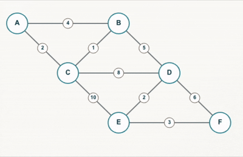
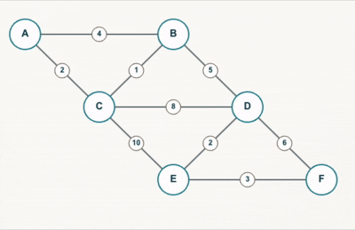

# 최소 신장 트리(Minimum Spanning Tree)
신장 트리는 무방향 그래프에서 모든 노드를 사이클 없이 잇는 그래프이며, 노드를 잇는 간선의 가중치 합이 최소인 신장 트리를 최소 신장 트리(Minimum Spanning Tree, 이하 MST)라 한다.

## 최소 신장 트리의 대표적인 알고리즘

### 크루스칼(kruskal) 알고리즘

그래프의 간선을 하나씩 늘리며 MST를 만든다. 간선을 늘릴 때 가중치가 최소인 간선부터 추가하는 탐욕법을 이용한다.

**동작 과정**

1) 간선은 가중치를 기준으로 오름차순 정렬한다.

2) 간선을 하나씩 살핀다. 간선을 MST에 추가했을 때 MST에 사이클이 생기지 않으면 추가한다. 사이클이 생긴다면 다음 간선으로 넘어간다.

### 프림(Prim) 알고리즘

그래프의 노드를 하나씩 늘리며 MST를 만든다. 정점을 늘릴 때 정점과 연결된 간선의 가중치가 최소인 것부터 추가하는 탐욕법을 이용한다.

**동작 과정**

1) 시작 정점을 고른다. 시작 정점을 MST에 추가한다.

2) 정점과 이어진 간선을 살핀다. 간선과 이어진 다음 정점이 MST에 있지 않다면 이 정점과 간선을 최소 힙에 추가한다.

3) 최소 힙에서 꺼낸 정점이 MST에 포함되어 있지 않다면 MST에 추가하고 **2 단계**를 진행한다. 만약 꺼낸 정점이 MST에 포함되어 있으면 넘어간다.

4) 최소 힙이 빌 때까지 **3 단계**를 반복한다.

## 최소 신장 트리 활용 분야

- 네트워크 설계 및 인프라 구축: 최소 신장 트리는 통신 네트워크, 전력 그리드, 컴퓨터 네트워크 등의 설계에 널리 사용된다. 최소한의 비용으로 모든 지점을 연결하여 효율적인 네트워크 설계를 가능하게 한다.(DFS, BFS 활용)
- 군집화 알고리즘: 데이터 포인트들 사이의 거리를 기반으로 클러스터를 형성할 때 최소신장트리가 사용될 수 있다. 예를 들어, 머신러닝에서는 MST를 사용하여 데이터를 자연스러운 그룹으로 나누는 데 도움을 준다.
- 회로 설계 및 VLSI(대규모 집적회로) 설계: 전자 회로의 핵심 구성 요소를 연결하는 데 필요한 배선 길이를 최소화하기 위해 MST가 사용된다. 이는 회로의 크기와 비용을 줄이는 데 이바지한다.
- 도로, 파이프라인 및 기타 교통망 설계: 최소 신장 트리는 도로망, 수도 및 가스 파이프라인, 철도망 등의 기반 구축에 있어 총 건설 비용을 최소화하는 데 사용된다.
- 이미지 처리: 이미지의 영역 분할(segmentation)에서 최소 신장 트리를 이용해 이미지의 다른 부분을 구분하기도 한다. 이를 통해 이미지에서 중요한 구조를 식별하고 분석할 수 있다.
- 물류 및 배송: 물류 네트워크에서 각 지점을 최소 비용으로 연결하여 전체 배송 비용을 줄이는 데 활용된다.