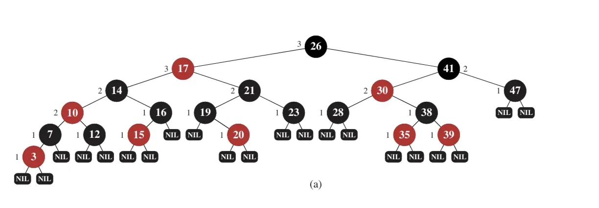
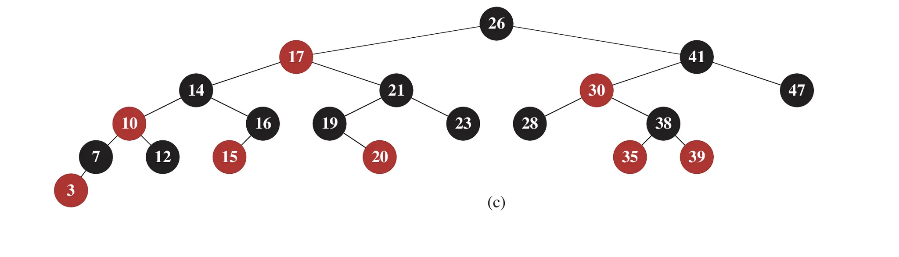
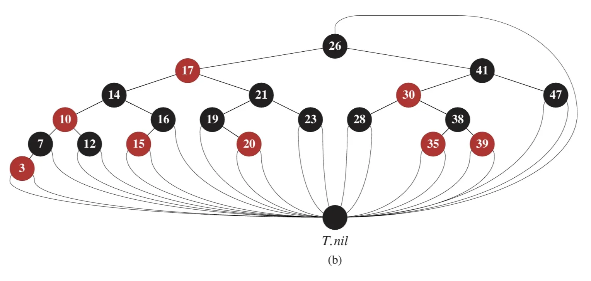
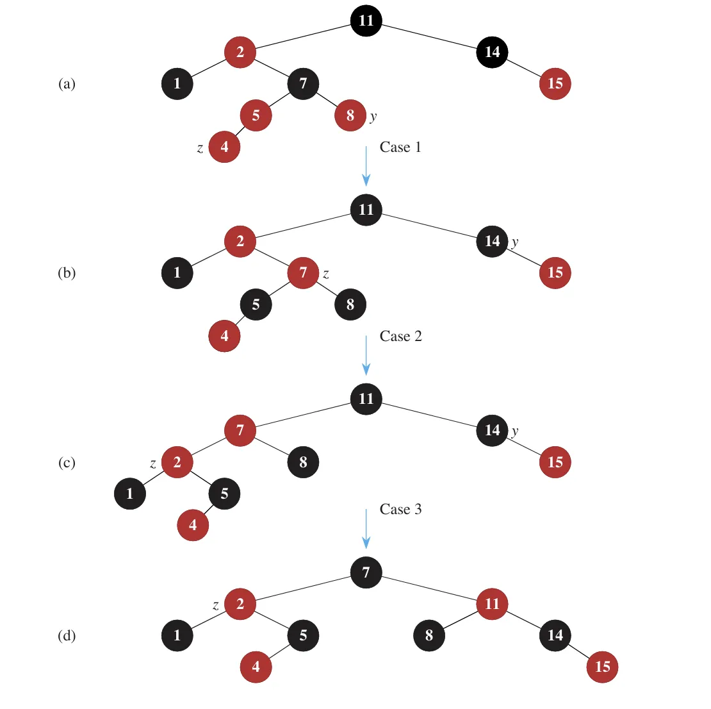
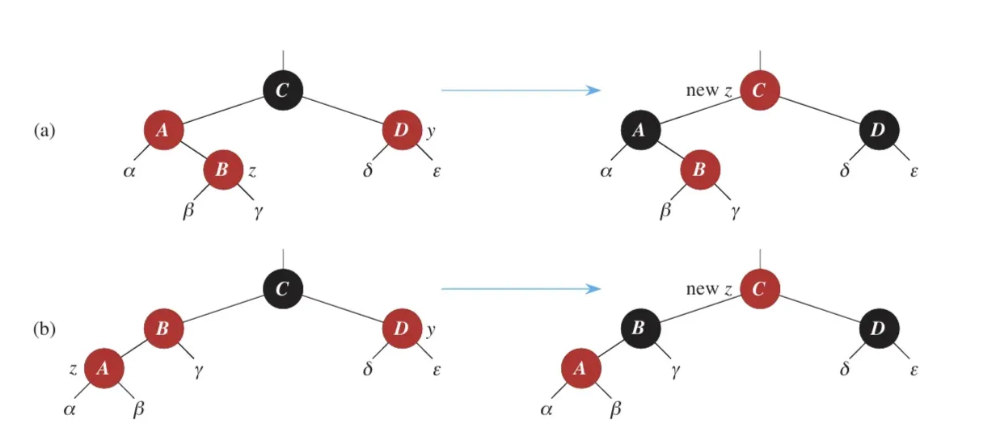
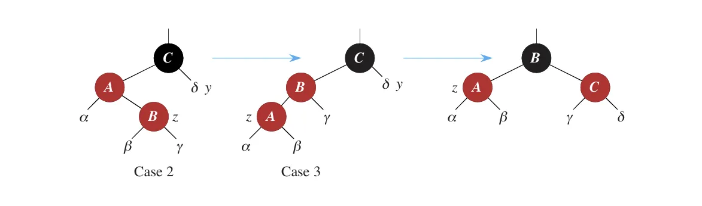

#  🍉레드 블랙 트리
## 🌲 레드블랙트리(Red-Black Tree)란?

     💡 레드블랙트리(Red-Black Tree)는 **각 노드가 색깔 속성을 가지는 자가 균형 이진 탐색 트리**의 일종으로, **대칭형 이진 B-트리**에서 발전한 자료구조이다.


### 🔹 목적

- 삽입과 삭제 시 **트리의 균형을 유지**하여, 효율적인 데이터 검색과 조작을 보장하는 것.
- 각 노드는 색깔 정보를 저장하기 위해 **1비트의 추가 기억 공간**을 사용한다.

### 🔹 핵심 특징

- 루트에서 리프까지의 경로에서 **노드 색에 대한 제약**을 통해,
    
    > 어느 경로도 다른 경로보다 두 배 이상 길지 않도록 보장
    > 
    > → 결과적으로 **근사적 균형 유지**
    > 
<br>

- 키가 n개일 때 트리의 **최대 높이**는
    
    $$
    h \leq 2 \log_2(n + 1)
    $$
    
- 삽입, 삭제, 탐색 연산의 **시간 복잡도는**
    
    $$
    \boxed{O(\log n)}
    $$
    

- 최악의 경우에도 일정한 실행 시간을 보장하며, **실시간 처리 시스템**, **기하학적 계산 자료구조** 등에 활용된다.

---

## 📏 용어 정리

- **Black-height (bh)**: 특정 노드 $x$ 에서 리프 노드까지의 경로에서 만나는 **BLACK 노드의 수** (단, $x$ 자신은 제외).
<br>이를 $bh(x)$로 나타내며, 속성 5에 따라 모든 경로에서 동일하게 유지된다.
- 트리 전체의 black-height는 루트 노드의 $bh$이다.
- **Internal Node**: 키를 가지는 일반 노드
- **External Node (NIL)**: 모든 말단 노드의 포인터가 가리키는 가상의 리프 노드 (BLACK이며, 실제 저장 공간을 쓰지 않도록 sentinel로 대체한다)

### 🔹 노드가 가지는 주요 속성

- `color`, `key`, `left`, `right`, `p(부모)`
- 자식이나 부모가 존재하지 않는 경우, 해당 포인터 필드는 `NIL`로 설정된다.
- `NIL`은 리프 노드에 대한 포인터로 간주하며, 
실제 키를 가진 노드는 **내부 노드(internal node)**로 간주한다.

---

### 🔹 레드블랙트리의 5가지 속성 (Red-Black Properties)

1. 모든 노드는 **레드** 또는 **블랙**이다.
2. 루트 노드는 **블랙**이다.
3. 모든 리프(`NIL`)는 **블랙**이다.
4. 어떤 노드가 **레드**라면, 그 자식 노드들은 **모두 블랙**이다.
5. 어떤 노드에서 리프까지의 **모든 경로는 동일한 개수의 블랙 노드**를 포함한다.

---

## 🔹 경계 노드(sentinel)의 사용

- 경계 조건을 단순화하기 위해, **모든 `NIL` 포인터는 하나의 sentinel 노드(`T.nil`)**로 처리한다.
- `T.nil`은 모든 리프를 대체하는 **공용 블랙 노드**로, 실제 데이터는 없으며 조건 비교와 회전 처리 시 코드 단순화를 돕는다.

### 📌 예시 그림



> (a) 레드블랙트리 예시: 모든 리프 노드(NIL)는 블랙이며, 각 내부 노드는 해당 노드의 black-height 값이 함께 표시되어 있다. NIL 노드의 black-height는 0이다.
> 

### 📌 간략화된 표현



> (c) **단순화된 트리 표현**: 핵심 구조에 집중하고 시각적 복잡도를 줄이기 위해 리프 노드들과 루트의 부모를 생략한 형태이다.
> 

### 📌 sentinel을 사용한 표현



> (b) **sentinel 사용 예시**: 모든 NIL을 단일 sentinel 노드 `T.nil`로 대체한 트리 구조. black-height 표시는 생략되었으며, 루트의 부모 또한 `T.nil`이다.
> 

---

## ✍️트리 노드 개수 증명하기

<aside>
💡

**내부 노드가 $n$개인 레드블랙트리의 높이 $h$는 다음을 만족한다**

$$

h \leq 2 \log_2(n + 1)

$$

</aside>

### 📌 증명 개요

1. 어떤 노드 $x$에서 시작하는 서브트리는 최소
    
    $$
    2^{bh(x)} - 1
    $$
    
    개의 내부 노드를 포함한다 (귀납법 사용).
    
2. 루트 노드의 black-height는 $bh(\text{root}) \geq \frac{h}{2}$이므로:

$$
n \geq 2^{h/2} - 1 \Rightarrow h \leq 2 \log_2(n + 1)
$$

➡️ 따라서 **레드블랙트리는 항상 O(log n) 높이**를 유지하며, 이는 **탐색, 삽입, 삭제**의 시간 복잡도가 모두

$$
\boxed{O(\log n)}
$$

임을 의미한다.

---

## 📚정리의 직접적인 결과 및 구현 주의

### ✔️ 동적 집합 연산의 시간 복잡도

정리 13.1에 따라, 다음과 같은 **동적 집합 연산들**:

- `SEARCH`
- `MINIMUM`
- `MAXIMUM`
- `SUCCESSOR`
- `PREDECESSOR`

은 모두 **레드블랙트리에서  $O(\log n)$**  시간 안에 실행된다.

> 이유: 이 연산들은 높이 $h$ 인 일반 이진 탐색 트리에서 $O(h)$ 에 수행되며,
> 
> 
> 레드블랙트리는 항상  $h = O(\log n)$을 보장하기 때문이다.
> 

### ✔️ TREE-INSERT, TREE-DELETE에 대한 주의

- Chapter 12의 일반 BST용 `TREE-INSERT`, `TREE-DELETE` 알고리즘도 $O(\log n)$ 에 실행되지만,
- **레드블랙트리에 그대로 적용하면 색 속성 위반**이 발생해 불법 상태가 될 수 있다.
- 앞으로, **레드블랙 속성을 유지하면서도 $O(\log n)$  시간 안에 수행되는 삽입·삭제 방법**을 설명 할 것이다.

---

## 🌳레드블랙트리의 삽입 과정

레드블랙트리의 삽입은 **이진 탐색 트리(BST) 방식의 삽입**과

삽입 후 발생할 수 있는 **레드블랙트리 속성 위반을 복구하는 과정**으로 나뉜다.

---

## 📌 삽입 개요

1. 새 노드는 BST 규칙에 따라 삽입되고 색깔은 **항상 RED**로 설정된다.
2. 삽입으로 인해 **부모가 RED인 경우**, 속성 위반이 발생할 수 있으며,
    
    이때 `rb_insert_fixup()`을 통해 **회전과 색 변경**으로 트리를 복구한다.
    



---

## 🧱 삽입 함수 (BST + Fixup 호출)

```python
def rb_insert(tree, z):
    y = tree.nil
    x = tree.root

    while x != tree.nil:
        y = x
        if z.key < x.key:
            x = x.left
        else:
            x = x.right

    z.parent = y
    if y == tree.nil:
        tree.root = z
    elif z.key < y.key:
        y.left = z
    else:
        y.right = z

    z.left = tree.nil
    z.right = tree.nil
    z.color = RED

    rb_insert_fixup(tree, z)

```

---

## 🔄 삽입 후 트리 복구 (`rb_insert_fixup`)

삽입으로 인해 색 속성이 깨질 수 있는데, 이때 **부모, 삼촌, 조부모의 색과 위치**에 따라 3가지 경우로 나눠 회전 또는 색 변경으로 복구한다.

---

### 📎 Case 분류

✔️ 다음은 삽입 후 속성 위반을 복구하는 세 가지 대표적인 경우이다:

| Case | 조건 | 처리 |
| --- | --- | --- |
| Case 1 | 부모, 삼촌 모두 RED | 부모와 삼촌을 BLACK, 조부모를 RED로 바꾸고 조부모 기준으로 재검사 |
| Case 2 | 부모는 RED, 삼촌은 BLACK, z는 부모의 반대 방향 자식 | 부모 기준 회전 후 Case 3로 전환 |
| Case 3 | 부모는 RED, 삼촌은 BLACK, z는 부모와 같은 방향 자식 | 조부모 기준 회전 및 색 변경 |



---

## 🧩 복구 함수 코드

```python
def rb_insert_fixup(tree, z):
    while z.parent.color == RED:
        if z.parent == z.parent.parent.left:
            y = z.parent.parent.right  # 삼촌
            if y.color == RED:
                # Case 1
                z.parent.color = BLACK
                y.color = BLACK
                z.parent.parent.color = RED
                z = z.parent.parent
            else:
                if z == z.parent.right:
                    # Case 2
                    z = z.parent
                    left_rotate(tree, z)
                # Case 3
                z.parent.color = BLACK
                z.parent.parent.color = RED
                right_rotate(tree, z.parent.parent)
        else:
            # 부모가 오른쪽인 경우 (대칭)
            y = z.parent.parent.left
            if y.color == RED:
                z.parent.color = BLACK
                y.color = BLACK
                z.parent.parent.color = RED
                z = z.parent.parent
            else:
                if z == z.parent.left:
                    z = z.parent
                    right_rotate(tree, z)
                z.parent.color = BLACK
                z.parent.parent.color = RED
                left_rotate(tree, z.parent.parent)
    tree.root.color = BLACK

```

---

## 🔃 회전 함수

```python
def left_rotate(tree, x):
    y = x.right
    x.right = y.left
    if y.left != tree.nil:
        y.left.parent = x
    y.parent = x.parent
    if x.parent == tree.nil:
        tree.root = y
    elif x == x.parent.left:
        x.parent.left = y
    else:
        x.parent.right = y
    y.left = x
    x.parent = y

def right_rotate(tree, y):
    x = y.left
    y.left = x.right
    if x.right != tree.nil:
        x.right.parent = y
    x.parent = y.parent
    if y.parent == tree.nil:
        tree.root = x
    elif y == y.parent.right:
        y.parent.right = x
    else:
        y.parent.left = x
    x.right = y
    y.parent = x

```

---

## 🔎 시각적으로 본 Case 2 → Case 3 → 균형 복구

회전은 Case 2의 삼각형 형태를 Case 3의 직선형으로 만든 후,

Case 3에서 조부모를 기준으로 회전하면서 트리를 복구한다.



---

## 💭 AVL 트리와 비교

<aside>
❓

“색깔 비트를 따로 저장해야 한다면 AVL트리보다 효율이 안 좋은거 아니야?” 

라는 의문이 들 수 있지만, 꼭 그렇지만은 않다.

</aside>

| 항목 | 레드블랙트리 | AVL 트리 |
| --- | --- | --- |
| 추가 공간 | 색 정보 1비트 | 균형 인수 2비트 이상 |
| 공간 효율 | 높음 | 낮음 |
| 삽입/삭제 회전 수 | 적음 | 많음 |
| 검색 성능 | AVL이 약간 더 우수 | ✅ |
| 삽입/삭제 빈도 높은 경우 | ✅ 적합 | 부적합 |
| 검색 위주 환경 | 적합 | ✅ 더 적합 |
- 레드블랙트리는 색 비트 1비트만으로 공간 효율이 뛰어나며, 삽입/삭제 시 회전이 적어 연산 부담이 낮다.
- 반면 AVL은 더 엄격한 균형을 유지하지만, 회전 비용이 크다.
- 따라서
    - **삽입/삭제가 자주 일어나는 시스템에는 레드블랙트리가**,
    - **정적 데이터나 검색 중심 환경에는 AVL이 적합하다.**

---

## 출처 및 참고
- Geeks for Geeks : <a herf="Introduction to Red-Black Tree">Introduction to Red-Black Tree</a>
- Introduction_to_algorithms-4th Edition : 13장 Red-Black Trees