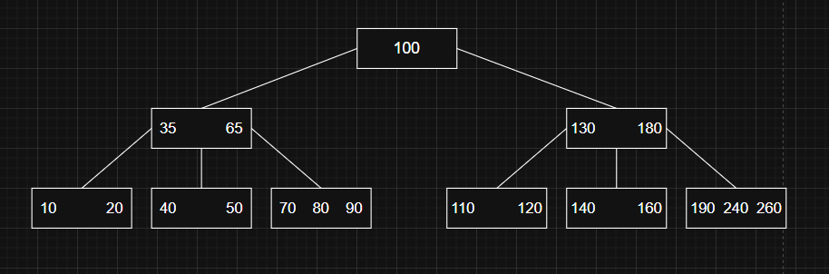
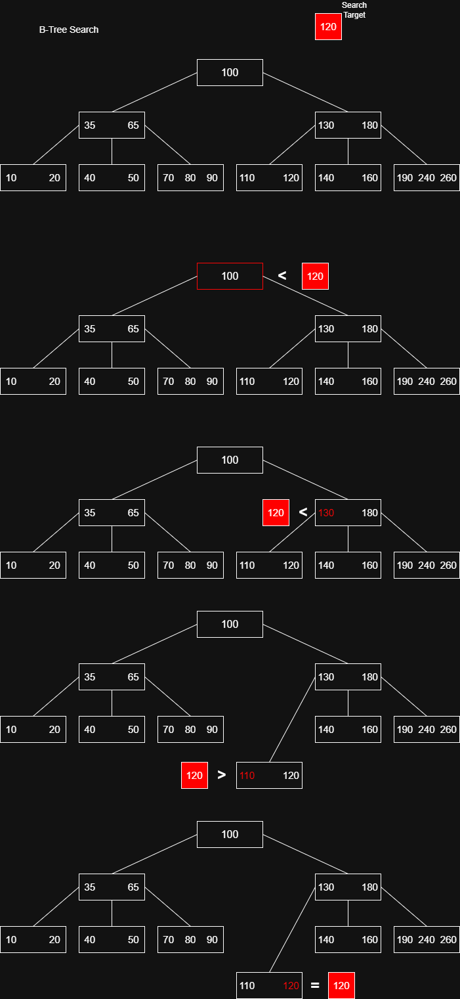
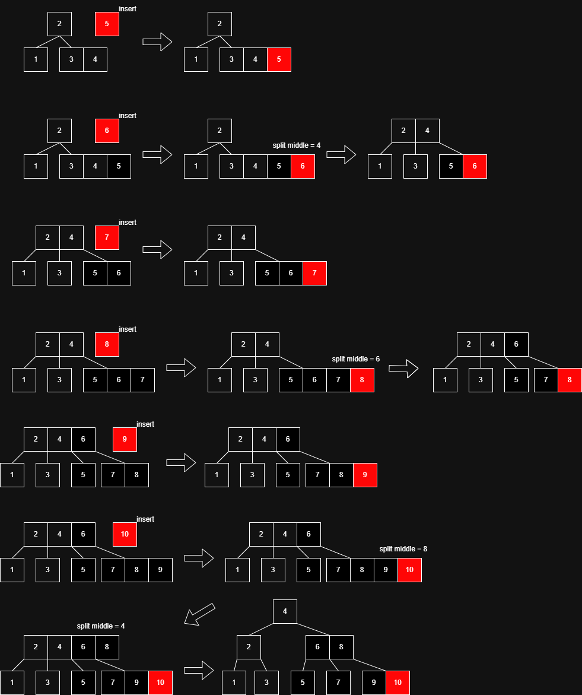
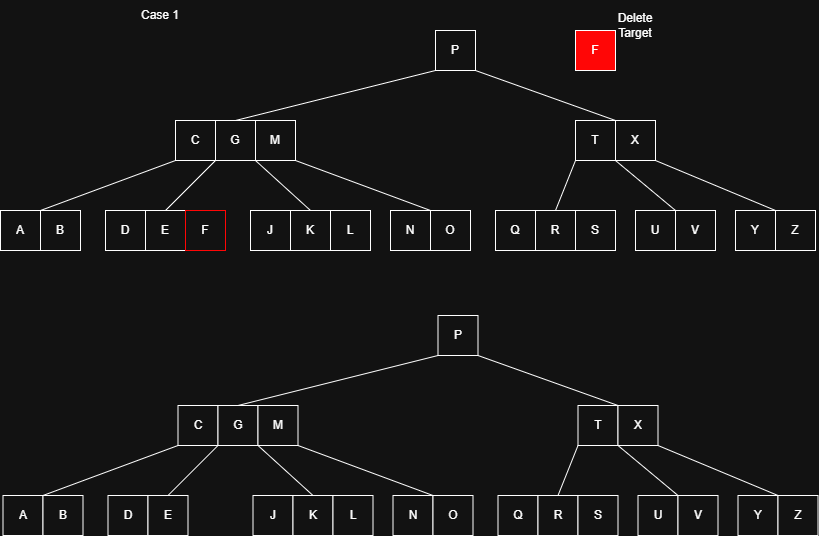
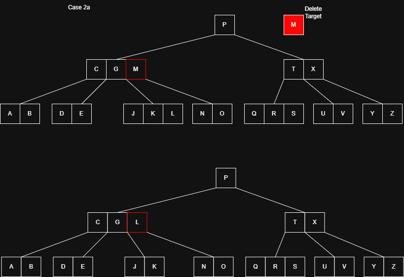
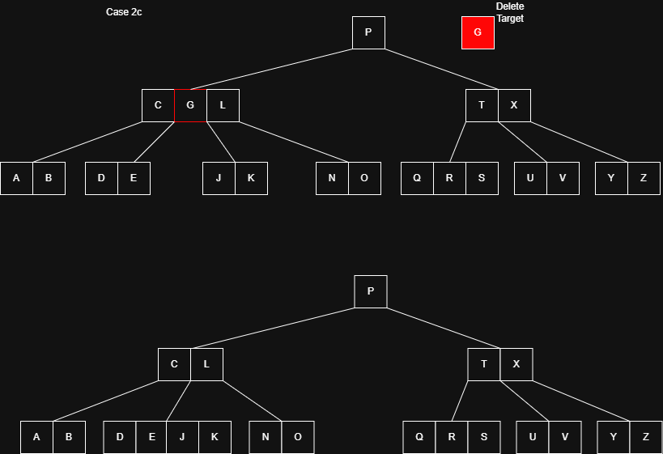
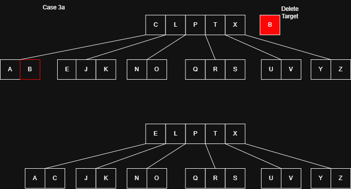
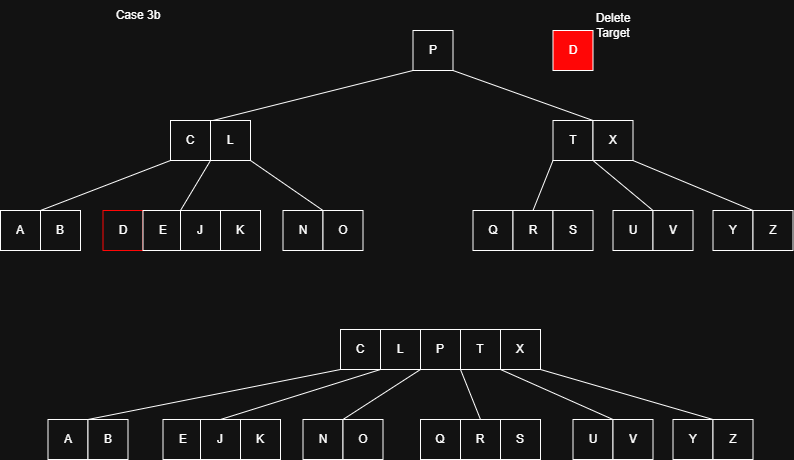

### B-Tree 란?

- B-Tree는 다원 탐색 트리(m-way search tree)로,  
디스크 기반 저장 시스템에서 **데이터 접근 속도를 최적화하기 위해 설계된** 균형 트리다.
- 하나의 노드는 **여러 개의 키**와 **여러 자식 노드**를 가질 수 있어 트리의 **높이를 낮게 유지**할 수 있다.
- 주로 데이터베이스, 파일 시스템 등 **대용량 데이터**를 다루는 환경에서 사용된다.
- 항상 균형을 유지하므로 검색, 삽입, 삭제 연산에서 일관되고 효율적인 성능을 보장한다.




---

### B-Tree 특징

- 모든 **리프 노드는 동일한 깊이**를 가진다.
- 각 노드의 키는 **오름차순으로 정렬되어 저장**된다.
- **하나의 노드에 여러 키**를 저장할 수 있어 디스크 접근 횟수가 줄고 성능이 향상된다.
- **B-Tree 노드**는 최소 `⌈m/2⌉`개의 자식을 가져야 한다.

---

### 노드의 키 / 자식 수 규칙 (B-Tree of order `m`)

- 각 노드는 **최대 `m`개의 자식**, **최대 `m - 1`개의 키**를 가질 수 있다.
- **최소 자식 수**: 루트를 제외한 모든 내부 노드는 최소 `⌈m / 2⌉`개의 자식을 가져야 한다.
- **최소 키 수**:
    - 루트가 아닌 노드는 최소 `⌈m / 2⌉ - 1`개의 키를 가져야 한다.
    - 루트 노드는 최소 **1개의 키**를 가져야 하며,
    **리프가 아닐 경우 최소 2개의 자식**을 가져야 한다.
- **자식 수 = 키 수 + 1**의 관계를 가진다. 즉, **키가 n-1개이면 자식은 n개**다.

---

### B-Tree의 시간 복잡도

- `n`: B-트리에 저장된 전체 키의 수를 나타낸다.
    
    > B-Tree는 일반적인 이진 탐색 트리보다 높이가 낮기 때문에 실제 성능이 더 우수하다.
      
| 연산 | 시간 복잡도 |
| :---: | :---: |
| 검색 (Search) | O(log n) |
| 삽입 (Insert) | O(log n) |
| 삭제 (Delete) | O(log n) |
| 순회 (Traverse) | O(n) |


---

## B-Tree의 장단점

### 장점

- 항상 균형을 유지하므로 기본 연산이 O(log n) 시간에 수행된다.
- 높은 동시성과 처리량을 제공한다.
- 디스크 공간을 효율적으로 활용할 수 있다.

### 단점

- 디스크 사용량이 많아질 수 있다.
- 데이터셋이 작을 경우, 이진 탐색 트리보다 비효율적일 수 있다.

---

### B-Tree의 활용

- 데이터베이스 인덱싱 (MySQL, PostgreSwQL 등)
- 파일 시스템 (NTFS, HFS 등)
- 블록 기반 저장 장치의 검색 최적화
- 대규모 정렬 및 탐색 처리

---

## B-Tree의 탐색

B-Tree에서의 탐색은 이진 탐색 트리와 유사하게 동작한다.  
탐색할 키를 `k`라고 할 때, 다음과 같은 절차를 따른다.

1. 루트 노드에서 시작해 재귀적으로 내려간다.
2. 현재 노드에서 다음을 수행한다.
    - 노드에 키 `k`가 존재하면 해당 노드를 반환한다.
    - 키 `k`보다 큰 첫 번째 키 앞에 위치한 자식 노드로 이동한다.
3. 리프 노드까지 반복한다.
4. 리프 노드에 도달했으나 키를 찾지 못한 경우 NULL을 반환한다.

B-Tree의 각 노드는 여러 개의 키를 포함하며, 키의 범위를 기준으로 탐색할 자식 노드를 결정한다.  
이때 키들은 분리 값(separation values) 역할을 하여 탐색 범위를 제한하고 탐색 효율을 높인다.



---

## B-Tree의 삽입

B-Tree에서는 새로운 키를 **항상 리프 노드에 삽입**한다.  
루트 노드에서 시작하여 적절한 리프 노드로 내려간다.  
노드마다 **삽입 전 가득 찼는지 확인**해야 한다.

### 삽입 절차

1. 루트부터 시작하여 적절한 위치로 내려간다.
2. **내려가기 전**, 현재 노드가 **가득 찼는지 확인**한다.
    - 가득 찼다면 `splitChild()` 연산을 수행하여 노드를 분할한다.
3. 리프 노드에 도달하면, 키를 **오름차순 정렬을 유지하며 삽입**한다.

### splitChild() 동작

- 가득 찬 자식 노드를 두 개로 분할한다.
- 중간 키는 부모 노드로 이동하여 삽입된다.
- 삽입할 키가 분할된 두 노드 중 어느 쪽으로 가야 할지 판단하여,  
적절한 자식 노드로 재귀적으로 삽입을 진행한다.



---

## B-Tree의 삭제

B-Tree에서 삭제는 삽입보다 복잡하다.  
삭제 대상이 **내부 노드**에 있을 수 있어, **자식 노드의 재배치**가 필요하다.  
삭제 시에도 B-Tree의 **균형 조건**과 **최소 키 개수 조건**(t - 1)을 유지해야 한다.

### 삭제의 세 가지 경우

### Case 1: **키가 리프 노드에 존재하는 경우**

- 단순히 해당 키를 제거한다.
    
    
    

### Case 2: **키가 내부 노드에 존재하는 경우**

- 내부 노드에서 키 `k`를 삭제하려면 다음 중 하나를 수행한다

**2a.** `k`의 왼쪽 자식에 **t개 이상의 키**가 있는 경우

→ `k`의 전임자 `k₀`를 찾아 `k`를 `k₀`로 대체하고, `k₀`를 재귀적으로 삭제한다.




**2b.** `k`의 오른쪽 자식에 **t개 이상의 키**가 있는 경우

→ `k`의 후임자 `k₀`를 찾아 `k`를 `k₀`로 대체하고, `k₀`를 재귀적으로 삭제한다.

**2c.** 양쪽 자식(y, z) 모두 키가 `t-1`개뿐인 경우

→ `k`, 왼쪽 자식, 오른쪽 자식을 병합하여 하나의 노드로 만들고, 병합된 노드에서 `k`를 재귀적으로 삭제한다.



### Case 3: **삭제할 키가 현재 노드에 없고 자식 노드로 내려가야 하는 경우**

- 키가 포함될 가능성이 있는 자식 노드의 키 개수가 `t - 1`개라면, 먼저 **보강 작업**을 수행한다.

**3a.** 형제 노드 중 하나에 **t개 이상 키가 있는 경우**

→ 형제에게서 키를 하나 빌려와 현재 노드를 보강하고 하위로 내려간다.



**3b.** 현재 노드와 양쪽 형제가 모두 `t-1`개 키만 가진 경우

→ 한 형제와 병합하고 중간 키를 내려보낸 뒤, 병합된 노드에서 재귀적으로 삭제를 진행한다.



### 특이 케이스: 루트 노드가 비게 되는 경우

- 루트가 내부 노드이지만 키가 하나도 없게 되면, **유일한 자식 노드가 새 루트**가 되며, 트리의 **높이가 1 감소**한다.

---

### Code

```c
#include <stdio.h>
#include <stdlib.h>
#include <stdbool.h>

// B-tree 노드 구조체
typedef struct BTreeNode {
    int *keys;          // 키 배열
    struct BTreeNode **children;   // 자식 포인터 배열
    int min_degree;     // 최소 차수
    int key_count;      // 현재 키의 개수
    bool is_leaf;        // 리프 노드 여부
} BTreeNode;

// B-tree 구조체
typedef struct BTree {
    BTreeNode *root;    // 루트 노드
    int min_degree;     // 최소 차수
} BTree;

// 함수 선언
BTreeNode* create_node(int min_degree, bool is_leaf);
void traverse_tree(BTreeNode* node);
BTreeNode* search_key(BTreeNode* node, int key);
void insert_non_full(BTreeNode* node, int key);
void split_child(BTreeNode* parent, int index, BTreeNode* child);
void insert_key(BTree* tree, int key);
int find_key_index(BTreeNode* node, int key);
void remove_from_tree(BTreeNode* node, int key);
void remove_from_leaf(BTreeNode* node, int idx);
void remove_from_non_leaf(BTreeNode* node, int idx);
int get_predecessor(BTreeNode* node, int idx);
int get_successor(BTreeNode* node, int idx);
void fill_node(BTreeNode* node, int idx);
void borrow_from_prev(BTreeNode* node, int idx);
void borrow_from_next(BTreeNode* node, int idx);
void merge_nodes(BTreeNode* node, int idx);
void remove_key(BTree* tree, int key);

// 노드 생성 함수
BTreeNode* create_node(int min_degree, bool is_leaf) {
    BTreeNode* new_node = (BTreeNode*)malloc(sizeof(BTreeNode));
    new_node->min_degree = min_degree;
    new_node->is_leaf = is_leaf;
    new_node->keys = (int*)malloc(sizeof(int) * (2*min_degree-1));
    new_node->children = (BTreeNode**)malloc(sizeof(BTreeNode*) * (2*min_degree));
    new_node->key_count = 0;
    return new_node;
}

// B-tree 생성 함수
BTree* create_btree(int min_degree) {
    BTree* tree = (BTree*)malloc(sizeof(BTree));
    tree->root = NULL;
    tree->min_degree = min_degree;
    return tree;
}

// 순회 함수
void traverse_tree(BTreeNode* node) {
    int i;
    for (i = 0; i < node->key_count; i++) {
        if (!node->is_leaf)
            traverse_tree(node->children[i]);
        printf("%d ", node->keys[i]);
    }
    if (!node->is_leaf)
        traverse_tree(node->children[i]);
}

// 검색 함수
BTreeNode* search_key(BTreeNode* node, int key) {
    int i = 0;
    while (i < node->key_count && key > node->keys[i])
        i++;
    
    if (i < node->key_count && key == node->keys[i])
        return node;
        
    if (node->is_leaf)
        return NULL;
        
    return search_key(node->children[i], key);
}

// 키 찾기 함수
int find_key_index(BTreeNode* node, int key) {
    int idx = 0;
    while (idx < node->key_count && node->keys[idx] < key)
        ++idx;
    return idx;
}

// 삽입 함수
void insert_key(BTree* tree, int key) {
    if (tree->root == NULL) {
        tree->root = create_node(tree->min_degree, true);
        tree->root->keys[0] = key;
        tree->root->key_count = 1;
    } else {
        if (tree->root->key_count == 2*tree->min_degree-1) {
            BTreeNode* s = create_node(tree->min_degree, false);
            s->children[0] = tree->root;
            split_child(s, 0, tree->root);
            int i = 0;
            if (s->keys[0] < key)
                i++;
            insert_non_full(s->children[i], key);
            tree->root = s;
        } else {
            insert_non_full(tree->root, key);
        }
    }
}

// 노드 분할 함수
void split_child(BTreeNode* parent, int index, BTreeNode* child) {
    BTreeNode* z = create_node(child->min_degree, child->is_leaf);
    z->key_count = child->min_degree - 1;
    
    for (int j = 0; j < child->min_degree-1; j++)
        z->keys[j] = child->keys[j+child->min_degree];
        
    if (!child->is_leaf) {
        for (int j = 0; j < child->min_degree; j++)
            z->children[j] = child->children[j+child->min_degree];
    }
    
    child->key_count = child->min_degree - 1;
    
    for (int j = parent->key_count; j >= index+1; j--)
        parent->children[j+1] = parent->children[j];
        
    parent->children[index+1] = z;
    
    for (int j = parent->key_count-1; j >= index; j--)
        parent->keys[j+1] = parent->keys[j];
        
    parent->keys[index] = child->keys[child->min_degree-1];
    parent->key_count = parent->key_count + 1;
}

// 비어있지 않은 노드에 삽입
void insert_non_full(BTreeNode* node, int key) {
    int i = node->key_count-1;
    
    if (node->is_leaf) {
        while (i >= 0 && node->keys[i] > key) {
            node->keys[i+1] = node->keys[i];
            i--;
        }
        node->keys[i+1] = key;
        node->key_count = node->key_count + 1;
    } else {
        while (i >= 0 && node->keys[i] > key)
            i--;
            
        if (node->children[i+1]->key_count == 2*node->min_degree-1) {
            split_child(node, i+1, node->children[i+1]);
            if (node->keys[i+1] < key)
                i++;
        }
        insert_non_full(node->children[i+1], key);
    }
}

// 삭제 함수
void remove_key(BTree* tree, int key) {
    if (!tree->root) {
        printf("트리가 비어있습니다\n");
        return;
    }
    
    remove_from_tree(tree->root, key);
    
    if (tree->root->key_count == 0) {
        BTreeNode* tmp = tree->root;
        if (tree->root->is_leaf)
            tree->root = NULL;
        else
            tree->root = tree->root->children[0];
        free(tmp);
    }
}

// 트리에서 키 삭제
void remove_from_tree(BTreeNode* node, int key) {
    int idx = find_key_index(node, key);
    
    if (idx < node->key_count && node->keys[idx] == key) {
        if (node->is_leaf)
            remove_from_leaf(node, idx);
        else
            remove_from_non_leaf(node, idx);
    } else {
        if (node->is_leaf) {
            printf("키 %d가 트리에 존재하지 않습니다\n", key);
            return;
        }
        
        bool flag = (idx == node->key_count);
        
        if (node->children[idx]->key_count < node->min_degree)
            fill_node(node, idx);
            
        if (flag && idx > node->key_count)
            remove_from_tree(node->children[idx-1], key);
        else
            remove_from_tree(node->children[idx], key);
    }
}

// 리프 노드에서 삭제
void remove_from_leaf(BTreeNode* node, int idx) {
    for (int i = idx+1; i < node->key_count; ++i)
        node->keys[i-1] = node->keys[i];
    node->key_count--;
}

// 비리프 노드에서 삭제
void remove_from_non_leaf(BTreeNode* node, int idx) {
    int key = node->keys[idx];
    
    if (node->children[idx]->key_count >= node->min_degree) {
        int pred = get_predecessor(node, idx);
        node->keys[idx] = pred;
        remove_from_tree(node->children[idx], pred);
    }
    else if (node->children[idx+1]->key_count >= node->min_degree) {
        int succ = get_successor(node, idx);
        node->keys[idx] = succ;
        remove_from_tree(node->children[idx+1], succ);
    }
    else {
        merge_nodes(node, idx);
        remove_from_tree(node->children[idx], key);
    }
}

// 이전 키 가져오기
int get_predecessor(BTreeNode* node, int idx) {
    BTreeNode* cur = node->children[idx];
    while (!cur->is_leaf)
        cur = cur->children[cur->key_count];
    return cur->keys[cur->key_count-1];
}

// 다음 키 가져오기
int get_successor(BTreeNode* node, int idx) {
    BTreeNode* cur = node->children[idx+1];
    while (!cur->is_leaf)
        cur = cur->children[0];
    return cur->keys[0];
}

// 노드 채우기
void fill_node(BTreeNode* node, int idx) {
    if (idx != 0 && node->children[idx-1]->key_count >= node->min_degree)
        borrow_from_prev(node, idx);
    else if (idx != node->key_count && node->children[idx+1]->key_count >= node->min_degree)
        borrow_from_next(node, idx);
    else {
        if (idx != node->key_count)
            merge_nodes(node, idx);
        else
            merge_nodes(node, idx-1);
    }
}

// 이전 노드에서 빌리기
void borrow_from_prev(BTreeNode* node, int idx) {
    BTreeNode* child = node->children[idx];
    BTreeNode* sibling = node->children[idx-1];
    
    for (int i = child->key_count-1; i >= 0; --i)
        child->keys[i+1] = child->keys[i];
        
    if (!child->is_leaf) {
        for (int i = child->key_count; i >= 0; --i)
            child->children[i+1] = child->children[i];
    }
    
    child->keys[0] = node->keys[idx-1];
    
    if (!child->is_leaf)
        child->children[0] = sibling->children[sibling->key_count];
        
    node->keys[idx-1] = sibling->keys[sibling->key_count-1];
    
    child->key_count += 1;
    sibling->key_count -= 1;
}

// 다음 노드에서 빌리기
void borrow_from_next(BTreeNode* node, int idx) {
    BTreeNode* child = node->children[idx];
    BTreeNode* sibling = node->children[idx+1];
    
    child->keys[child->key_count] = node->keys[idx];
    
    if (!child->is_leaf)
        child->children[child->key_count+1] = sibling->children[0];
        
    node->keys[idx] = sibling->keys[0];
    
    for (int i = 1; i < sibling->key_count; ++i)
        sibling->keys[i-1] = sibling->keys[i];
        
    if (!sibling->is_leaf) {
        for (int i = 1; i <= sibling->key_count; ++i)
            sibling->children[i-1] = sibling->children[i];
    }
    
    child->key_count += 1;
    sibling->key_count -= 1;
}

// 노드 병합
void merge_nodes(BTreeNode* node, int idx) {
    BTreeNode* child = node->children[idx];
    BTreeNode* sibling = node->children[idx+1];
    
    child->keys[node->min_degree-1] = node->keys[idx];
    
    for (int i = 0; i < sibling->key_count; ++i)
        child->keys[i+node->min_degree] = sibling->keys[i];
        
    if (!child->is_leaf) {
        for (int i = 0; i <= sibling->key_count; ++i)
            child->children[i+node->min_degree] = sibling->children[i];
    }
    
    for (int i = idx+1; i < node->key_count; ++i)
        node->keys[i-1] = node->keys[i];
        
    for (int i = idx+2; i <= node->key_count; ++i)
        node->children[i-1] = node->children[i];
        
    child->key_count += sibling->key_count + 1;
    node->key_count--;
    
    free(sibling);
}
```

---

### 참고한 자료

- GeeksforGeeks의 [Introduction of B-Tree](https://www.geeksforgeeks.org/introduction-of-b-tree-2/)
- GeeksforGeeks의 [Insert Operation in B-Tree](https://www.geeksforgeeks.org/insert-operation-in-b-tree/)
- GeeksforGeeks의 [Delete Operation in B-Tree](https://www.geeksforgeeks.org/delete-operation-in-b-tree/)