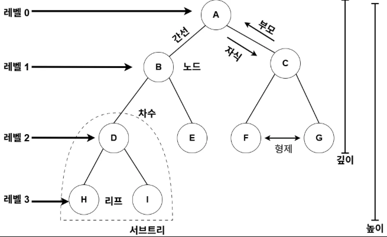
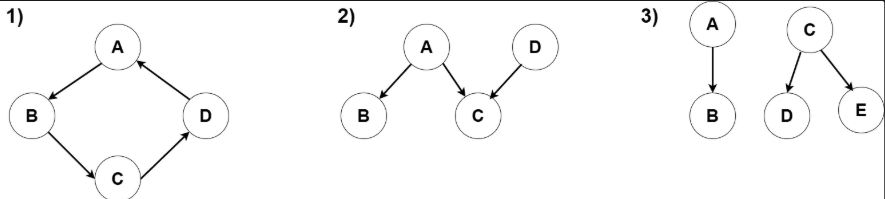

# Tree란?
트리는 계층적인 구조를 표현하는 데 사용하는 <b>추상 자료형(Abstract Data Type)</b>이다.

마치 실제 나무처럼 하나의 <b>뿌리(루트 노드)</b>에서 시작해서 가지를 뻗어나가는 형태를 상상해 볼 수 있다. 컴퓨터에서는 이 나무를 거꾸로 뒤집어 루트가 가장 위에 있고, 그 자식들이 아래로 내려가는 방식으로 시각화한다.

---

## Tree의 구성 요소와 특징
### 기본구성
트리는 크게 루트 노드와 이 루트에 연결된 <b>서브트리(Subtree)</b>들로 구성된 노드의 집합을 말한다. 

스택이나 큐처럼 데이터를 삽입하고, 찾고, 삭제하는 등의 동작을 할 수 있다. 다만 실제 구현은 배열이나 연결 리스트 등 다양한 방식으로 이루어질 수 있다. 

#### 현실 세계 활용 예시
이러한 계층적인 구조 덕분에 트리는 현실 세계의 다양한 위계 관계를 컴퓨터에서 효과적으로 표현할 수 있다.

- **가계도** : 조상이 루트가 되고 후손들이 자식 노드가 된다
- **회사 조직도** : CEO가 루트가 되고 하위 부서나 팀이 자식 노드가 된다

#### 자기 참조적 구조의 특징
트리의 중요한 특징 중 하나는 <b>자기 참조적(self-referential)</b> 구조라는 점이다. 

이는 트리가 자기 자신과 같은 구조를 내부에 포함하거나 참조한다는 의미가 된다. 즉, 각 자식 노드는 그 자체로 또 하나의 트리(서브트리)로 간주되며, 이러한 구조가 반복되면서 전체 트리를 형성하게 된다. 

#### 재귀적 정의와 순회
이러한 특성 덕분에 트리는 <b>재귀적으로 정의</b>되며, 트리의 모든 노드를 방문하는 순회 알고리즘도  
자연스럽게 재귀적인 방식으로 구현한다.

---
## Tree의 주요 명칭
트리 구조를 효과적으로 이해하고 분석하려면 다음과 같은 핵심 용어들을 알아두어야 한다.

### 기본 구성 요소
<b>루트 노드</b>에서 시작하여 하나 이상의 <b>자식 노드(Child Node)</b>들이 <b>간선(Edge)</b>으로 연결되어 있다.
#### 측정 관련 용어
| 용어         | 정의                                | 설명                                           |
|--------------|-------------------------------------|------------------------------------------------|
| <b>차수 (Degree)</b> | 특정 노드가 가진 자식 노드의 개수      | 예: 어떤 노드에 세 개의 자식이 있다면 차수는 3 |
| <b>크기 (Size)</b>   | 해당 노드와 그 아래 모든 자식을 포함한 총 노드 수 | 서브트리 전체의 규모를 나타냄                |
| <b>높이 (Height)</b> | 현재 노드에서 가장 멀리 떨어진 리프 노드까지의 최대 거리 | 아래로 향하는 최장 경로의 길이         |
| <b>깊이 (Depth)</b>  | 루트 노드에서 현재 노드까지의 거리      | 위에서 아래로 내려오는 경로의 길이             |

 
<b>Figure 1.</b> 트리 구성도

---

## Tree의 방향성과 레벨
### 레벨(Level) 체계
트리에서 레벨은 0부터 시작한다.

...

**레벨 0**: 루트 노드  
**레벨 1**: 루트의 직접 자식들  
**레벨 2**: 레벨 1 노드들의 자식들 

...

이는 프로그래밍에서 배열의 인덱스를 0부터 세는 관례와 일치하여 코드 구현 시 통일성과 효율성을 높여준다.

#### 방향성의 특징
트리는 **단방향 구조**이다.

- 데이터의 흐름이 한쪽으로만 진행
- 일반적으로 **위에서 아래**로 향하는 방향으로 표현
- 루트에서부터 데이터가 어떻게 퍼져나가는지 직관적으로 파악 가능

---

## 그래프(Graph)와 트리(Tree)의 차이점
### 공통점

노드와 간선으로 이루어진 자료구조

### 핵심 차이점: 순환의 유무
트리는 <b>순환(Cycle)이 없는 비순환 그래프(Acyclic Graph)</b>이다.

### Tree의 제약 조건
| 제약 조건       | 설명                                                              |
|----------------|-------------------------------------------------------------------|
| **재방문 불가**     | 어떤 경로를 따라가더라도 같은 노드를 두 번 방문할 수 없다           |
| **단방향 구조**     | 부모 노드에서 자식 노드로만 향하는 단방향 구조                    |
| **하나의 부모**     | 모든 노드는 하나의 부모 노드만 가짐 (루트 노드는 예외)             |
| **단일 루트**       | 반드시 하나의 루트 노드만 존재                                     |

### 결과적으로:

**Tree**: 계층적 구조 표현에 특화

**Graph**: 복잡하고 유연한 연결 관계 표현

<b>Figure 2</b> 트리가 아닌 예

---

## Tree가 아닌 예시 분석

아래 그림은 **트리의 정의를 위반하는 세 가지 사례**를 보여주고 있다.  
각각이 왜 트리가 아닌지를 하나씩 분석해보자

### ① Cycle(순환 구조)

- 이 구조는 노드 간에 순환이 발생한다.
- 앞서 설명했듯이 **트리는 사이클이 존재하지 않아야 하는 비 순환 그래프**이므로, 이 조건을 위반한다.
- 따라서 이는 트리가 아니다.

### ② 두 개의 부모 노드

- **C 노드가 A와 D 두 개의 부모를 가지고 있다.**
- 트리에서는 **모든 노드가 정확히 하나의 부모 노드만 가져야 하며**,  루트만이 예외적으로 부모가 없어야 한다

- 이 규칙을 어겼기 때문에 트리 구조가 될 수 없다.

### ③ 루트가 둘, 연결되지 않은 구조

- **A→B**와 **C→D→E**가 **서로 연결되어 있지 않으며**, 두 개의 루트 노드(A, C)가 존재한다.  
- 트리는 **하나의 루트에서 출발하여 모든 노드가 연결된 연결 그래프(Connected Graph)** 이어야 하며,  
**루트 노드는 반드시 하나만 존재해야 한다.**  
- 이 구조는 그 조건을 만족하지 않으므로 트리가 아니다.

---

> 지금까지 트리의 기본 개념과 특징, 그래프와의 차이점, 그리고 올바른 트리의 조건에 대해 알아보았다.  
트리는 데이터를 계층적으로 표현하고 탐색할 수 있는 매우 강력한 자료구조이다.
> 

> 하지만 우리가 실제로 다루는 데이터는 수천, 수만 개가 넘는 경우가 많다.  
단순한 트리 구조만으로는 이러한 대용량 데이터를 효율적으로 탐색하거나 저장하는 데 한계가 있다.
>